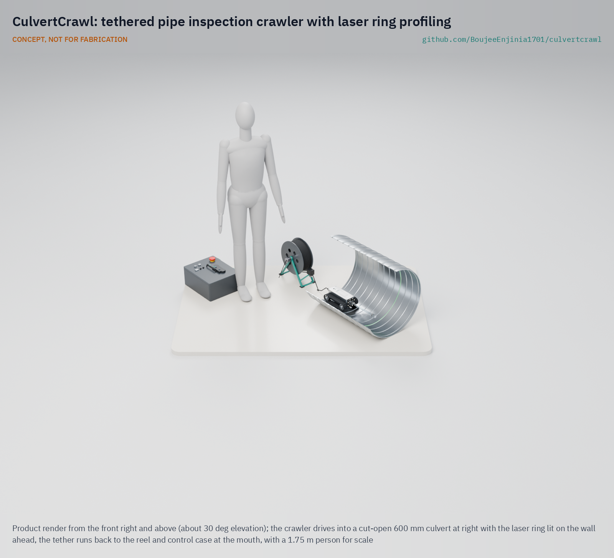
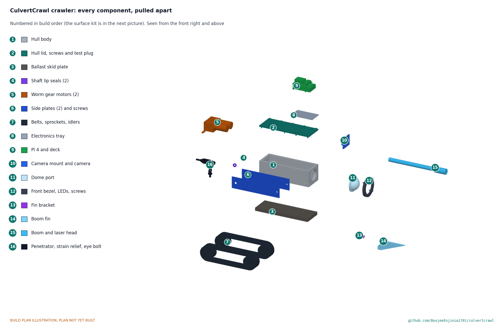

# CulvertCrawl

     

**Area:** Situational Field Hardware · **TRL:** 3 of 9 (proof of concept on paper) · **Value-engineering target:** $910 USD · **Difficulty:** 4 of 5

Tethered tracked crawler with a camera, lights and laser ring profiling that measures pipe deformation and blockage.

[Exploded render](media/render-exploded.png) · [Detail render](media/render-detail.png) · [Interactive 3D model](media/viewer.html) · [Concept blueprint (PDF)](media/concept-blueprint.pdf) · [General arrangement (PDF)](cad/drawings/CVC-DWG-001.pdf) · [Calculations](docs/04-calcs/01-sizing.md) · [Prototype build plan](docs/05-build-plan.md) · [Design decisions](docs/06-design-decisions.md) · [Review note](docs/REVIEW.md)

## Concept rationale

A small tracked crawler on a surface-powered tether is the simplest way to see and measure the middle of a pipe that nobody should enter. Putting the battery, the power conversion and the processing at the surface keeps the vehicle small, cool and free of lithium cells, and a projected laser ring turns ordinary video into a cross-section measurement, which is the number owners and inspectors actually need for deflection, sag and sediment. Commercial crawlers already prove the principle; what is missing is a version priced and documented for the road crews, small towns and watershed groups who own most small culverts.

Open hardware fits that gap. Every part is a hobby or industrial catalog item, a machined box or a plate a local shop can cut, so a county shop or a student team can build, seal and repair it, and the video, profiles and observation logs use open formats that feed existing defect-coding practice. At TRL 3 this is a paper design checked by calculation; it is not yet a tested inspection tool.

## Burning platform

Flooding reaches road networks through their drainage. A World Bank global assessment of 2,564 cities in 177 countries found that a 1-in-100-year flood directly exposes 14.7 % of urban roads, yet causes 44.8 % of simulated trips to fail as the damage cascades through the network ([He, Rentschler and Avner, World Bank, 2022](https://blogs.worldbank.org/en/developmenttalk/mobility-and-resilience-global-assessment-flood-impacts-urban-road-networks)). Culverts are among the small, buried links in those networks, and their condition is hard to see from outside.

Public money is now flowing into culverts faster than owners can survey them. The United States set aside $200 million a year for fiscal years 2022 to 2026, $1 billion in all, for the National Culvert Removal, Replacement, and Restoration Grant program ([FHWA](https://highways.dot.gov/iija/fact-sheets/national-culvert-removal-replacement-and-restoration-grants-culvert-aop-program)). In Washington State alone, a federal court injunction issued in March 2013 requires the state to correct fish-barrier culverts under its highways; by June 2026 WSDOT had corrected 200 of them and reopened 705 miles (about 1,130 km) of salmon and steelhead habitat, with more funding still needed ([WSDOT](https://wsdot.wa.gov/construction-planning/protecting-environment/fish-passage/federal-court-injunction-fish-passage)). Choosing which pipes to fix first depends on knowing their condition.

## Where it could be used

### By industry

| Industry | Use |
| --- | --- |
| Road and highway maintenance | Check cross-drain and driveway culverts before resurfacing, after floods and when a sinkhole appears |
| Municipal stormwater | Inventory the condition of small storm drains and outfalls to plan replacements |
| Civil construction quality assurance | Measure deflection of newly installed plastic pipe before a road is paved over it |
| Environmental and fisheries surveys | Look for blockages, perched outlets and internal barriers in fish-passage culverts |
| Rail, forestry and farm roads | Inspect the many small culverts under tracks, logging roads and field access routes |
| Engineering education | An open platform for teaching robotics, sealing, optics and inspection practice |

### By country or region

| Country or region | Why it matters there |
| --- | --- |
| United States | Florida DOT requires laser-profile video inspection of new pipe of 48 in or less and replaces pipe deflected 5 % or more ([FDOT Section 430](https://fdotwww.blob.core.windows.net/sitefinity/docs/default-source/specifications/by-year/2008/july-2008/workbook/ss4300000.pdf?sfvrsn=33cb5ec7_0)); Washington State is correcting fish-barrier culverts under a federal injunction ([WSDOT](https://wsdot.wa.gov/construction-planning/protecting-environment/fish-passage/federal-court-injunction-fish-passage)) |
| United Kingdom | More than one million culverts and outfalls, which can completely restrict flow, are often costly to maintain and need ongoing assessment for sedimentation and blockage ([CIRIA and Environment Agency, *Culvert, screen and outfall manual*, via GOV.UK](https://www.gov.uk/flood-and-coastal-erosion-risk-management-research-reports/culvert-screens-and-outfall-manual)); councils such as Devon note that culverting can worsen flood risk and raise maintenance needs ([Devon County Council](https://www.devon.gov.uk/floodriskmanagement/land-drainage-consent/culvert-guidance/)) |
| Cambodia and Southeast Asia | The World Bank and GFDRR support climate-resilient rural road programs because flooded rural roads cut critical access for rural communities ([GFDRR](https://www.gfdrr.org/en/feature-story/pathway-resilient-rural-roads-cambodia)) |
| India | About 783,700 km of rural road had been completed under the Pradhan Mantri Gram Sadak Yojana by August 2025, and contractors are now paid for maintenance on the condition of each road's cross-drainage works among other assets ([Press Information Bureau, Government of India](https://static.pib.gov.in/WriteReadData/specificdocs/documents/2025/sep/doc2025914636101.pdf)) |
| Mali and Sudan | The World Bank global assessment found that more than half of simulated urban trips fail in these countries even in floods of lower intensity, so small drainage links matter early ([World Bank, 2022](https://blogs.worldbank.org/en/developmenttalk/mobility-and-resilience-global-assessment-flood-impacts-urban-road-networks)) |

## What sparked the idea

The starting point was a construction specification. Since at least 2008 the Florida Department of Transportation's Standard Specifications, Section 430, have required contractors to inspect newly installed pipe of 48 in (1,200 mm) or less with "low barrel distortion video equipment with laser profile technology," to report deflection and diameter, and to replace pipe deflected 5 % or more ([FDOT Section 430, Rev 12-7-07](https://fdotwww.blob.core.windows.net/sitefinity/docs/default-source/specifications/by-year/2008/july-2008/workbook/ss4300000.pdf?sfvrsn=33cb5ec7_0)). The same clause lets the engineer waive the requirement for side drains and cross drains short enough to inspect from each end. That pairing shows both halves of the design: laser ring profiling is already the accepted way to measure a buried pipe, while short culverts, and the older pipes that no contract covers, are still judged from the ends. CulvertCrawl aims to put that measurement within reach of the crews who look after those pipes for the rest of their service lives.

## Problem

Small culverts and drains are hard to inspect without confined-space entry. Pipes of 300 to 900 mm (12 to 36 in) are too small or too hazardous to walk through, so most are judged from the ends, and commercial CCTV crawlers are priced for sewer contractors, not the road crews and small owners who look after most culverts.

Problem statement: [docs/01-problem.md](docs/01-problem.md)

## Concept

Tethered tracked crawler with a camera, lights and laser ring profiling that measures pipe deformation and blockage. A 6.6 kg crawler drives into the pipe on a 60 m tether carrying 48 V DC and Ethernet; a laser ring projected 300 mm ahead of a fisheye camera gives a cross-section every 6 mm, from which the operator's laptop reports diameter, ovality and sediment depth against distance. The TRL 3 calculations ([CVC-CAL-001](docs/04-calcs/01-sizing.md)) give 6.4 h per charge, about 75 m of reach driving uphill in a flooded pipe, and profile accuracy within 1 % of diameter from 300 to 900 mm (0.97 % at 900 mm, a thin margin). The wet reach depends on track friction under water, which only a test can settle. All figures are calculated estimates.

Full design precis: [docs/02-concept.md](docs/02-concept.md) · Requirements: [docs/03-requirements.md](docs/03-requirements.md) · Calculations: [docs/04-calcs/01-sizing.md](docs/04-calcs/01-sizing.md) · General arrangement: [cad/drawings/CVC-DWG-001.pdf](cad/drawings/CVC-DWG-001.pdf) · Model: [cad/src/model.py](cad/src/model.py)

## Key components

- Sealed aluminium hull with tracked chassis
- Self-locking worm gear motors (2)
- Waterproof fisheye camera behind a dome port
- LED ring light
- Class 2 laser ring projector (laser diode and conical mirror)
- 60 m hybrid tether on a reel with slip ring and payout counter
- Raspberry Pi 4 in the crawler
- Surface control box with LiFePO4 battery, 48 V boost and emergency stop

The priced bill of materials is in [bom/bom.csv](bom/bom.csv). Value-engineering target: $910 (a hypothetical control target, not a limit). Estimated cost of the constructable design: $1,034 ($124 over the target), because the parts that make the design buildable added $128. Cost drivers and savings worth trying are in the [design decisions register](docs/06-design-decisions.md).

## Building the prototype

The [prototype build plan](docs/05-build-plan.md) (CVC-BLD-001) shows, in pictures, how to make each component of the crawler, the tether reel and the surface box and put them together in 23 steps; nothing has been built yet. The hull, lid and front bezel are machined aluminium, the ballast plate is cut steel, the side plates, brackets, reel frames and box panel are cut from sheet and bar, the laser boom, fin and window are clear acrylic, and the motors, tracks, camera, electronics, tether and slip ring are bought. Writing the plan made the design buildable: a rim and pads inside the hull, side plates that tie the hull to the ballast plate, a bezel that clamps the dome, a fin that carries the laser boom, an eye bolt for the tether's strength member, a reel frame with bearings and a drop-in chassis for the surface box (CVC-DDR-003, open for Amish's review). Every picture is drawn from the model, and the model checks that each part touches what it should and clears what it should not.

## Repository layout

| Folder | Contents |
| --- | --- |
| `docs/` | Problem, concept, requirements, calculations and design decisions |
| `cad/src/` | build123d Python source, the source of truth for all geometry |
| `cad/step/`, `cad/stl/` | Exported models for FreeCAD, other CAD tools and printing |
| `cad/drawings/` | 2D sketches and dimensioned drawings |
| `bom/` | Bill of materials |
| `electronics/` | KiCad schematics and PCB layouts |
| `firmware/` | Microcontroller code |
| `media/` | Renders, perspectives and photos |
| `build-log/` | Dated prototyping notes |

## Documentation

Controlled documents follow the portfolio [documentation standard](.kit/STANDARDS.md). Each carries a document ID (CVC-PRC-001 for the precis), a version and a revision history. Branded PDFs are built with `python .kit/render.py` and attached to GitHub Releases when a document is tagged, for example `CVC-PRC-001/v1.0`.

## Credits

Designed by Amish Chadha. See [CONTRIBUTORS.md](CONTRIBUTORS.md) for roles. To cite this design, use [CITATION.cff](CITATION.cff) (GitHub shows it as "Cite this repository").

AI assistance (Claude) was used to accelerate concept renders, prototype documentation and first-pass sizing calculations. Design direction and all decisions are Amish Chadha's, recorded in this repository's decision records (`docs/decisions/`).

## Licenses

- **Hardware** (CAD, drawings, BOM, electronics): [CERN-OHL-S v2](LICENSE)
- **Software** (firmware, scripts, notebooks): [MIT](LICENSE-SOFTWARE)

A project of the [Design Molecule](https://designmolecule.com) lab.
