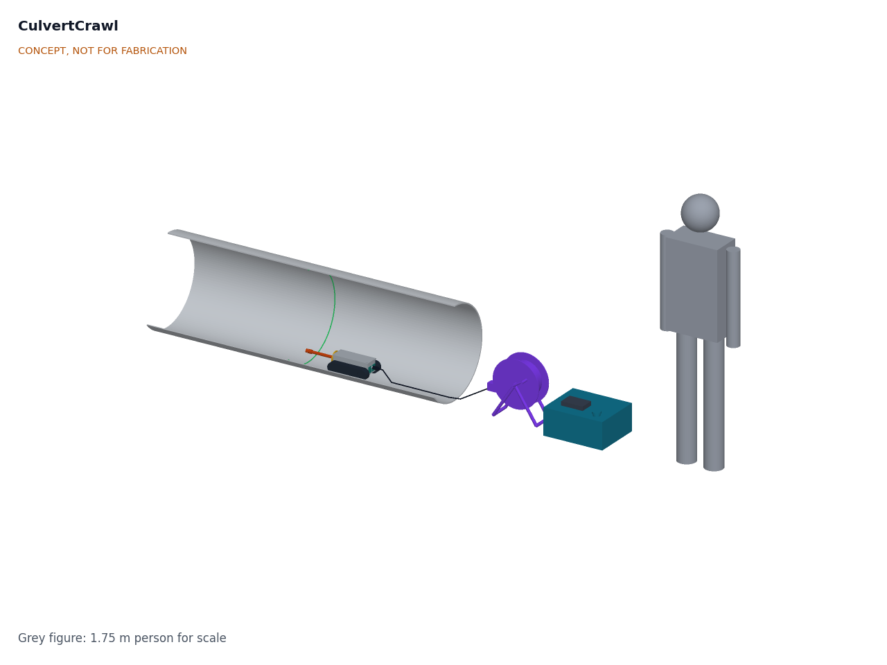

# CulvertCrawl

  

**Area:** Situational Field Hardware · **TRL:** 3 of 9 (proof of concept on paper) · **Prototype budget:** $900 USD · **Difficulty:** 4 of 5

Tethered tracked crawler with a camera, lights and laser ring profiling that measures pipe deformation and blockage.

[Interactive 3D model](media/viewer.html) · [Concept blueprint (PDF)](media/concept-blueprint.pdf) · [Review note](docs/REVIEW.md)

## Problem

Small culverts and drains are hard to inspect without confined-space entry. Pipes of 300 to 900 mm (12 to 36 in) are too small or too hazardous to walk through, so most are judged from the ends, and commercial CCTV crawlers are priced for sewer contractors, not the road crews and small owners who look after most culverts.

Problem statement: [docs/01-problem.md](docs/01-problem.md)

## Concept

Tethered tracked crawler with a camera, lights and laser ring profiling that measures pipe deformation and blockage. A 5.3 kg crawler drives into the pipe on a 60 m tether carrying 48 V DC and Ethernet; a laser ring projected 200 mm ahead of a fisheye camera gives a cross-section every 6 mm, from which the operator's laptop reports diameter, ovality and sediment depth against distance. The TRL 3 calculations ([CVC-CAL-001](docs/04-calcs/01-sizing.md)) give 6.4 h per charge and profile accuracy within 1 % of diameter in 300 and 600 mm pipe. Reach in a flooded pipe driving uphill (about 39 m against 50 m) and accuracy at 900 mm (about 1.6 %) are not yet met. All figures are calculated estimates.

Full design precis: [docs/02-concept.md](docs/02-concept.md) · Requirements: [docs/03-requirements.md](docs/03-requirements.md) · Calculations: [docs/04-calcs/01-sizing.md](docs/04-calcs/01-sizing.md) · General arrangement: [cad/drawings/CVC-DWG-001.pdf](cad/drawings/CVC-DWG-001.pdf) · Model: [cad/src/model.py](cad/src/model.py)

## Key components

- Sealed aluminium hull with tracked chassis
- Self-locking worm gear motors (2)
- Waterproof fisheye camera behind a dome port
- LED ring light
- Class 2 laser ring projector (laser diode and conical mirror)
- 60 m hybrid tether on a reel with slip ring and payout counter
- Raspberry Pi 4 in the crawler
- Surface control box with LiFePO4 battery, 48 V boost and emergency stop

The priced bill of materials is in [bom/bom.csv](bom/bom.csv). The indicative total is $901 against the $900 budget Amish set on 2026-09-25; see the [review note](docs/REVIEW.md).

## Repository layout

| Folder | Contents |
| --- | --- |
| `docs/` | Problem, concept, requirements, calculations and design decisions |
| `cad/src/` | build123d Python source, the source of truth for all geometry |
| `cad/step/`, `cad/stl/` | Exported models for FreeCAD, other CAD tools and printing |
| `cad/drawings/` | 2D sketches and dimensioned drawings |
| `bom/` | Bill of materials |
| `electronics/` | KiCad schematics and PCB layouts |
| `firmware/` | Microcontroller code |
| `media/` | Renders, perspectives and photos |
| `build-log/` | Dated prototyping notes |

## Documentation

Controlled documents follow the portfolio [documentation standard](.kit/STANDARDS.md). Each carries a document ID (CVC-PRC-001 for the precis), a version and a revision history. Branded PDFs are built with `python .kit/render.py` and attached to GitHub Releases when a document is tagged, for example `CVC-PRC-001/v1.0`.

## Licenses

- **Hardware** (CAD, drawings, BOM, electronics): [CERN-OHL-S v2](LICENSE)
- **Software** (firmware, scripts, notebooks): [MIT](LICENSE-SOFTWARE)

Part of the open hardware portfolio at [amishchadha.com](https://amishchadha.com).
