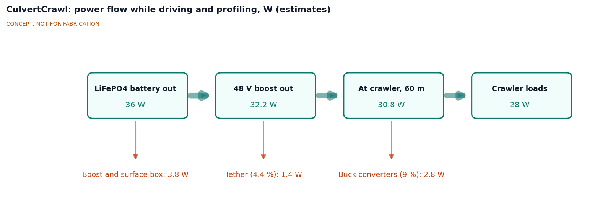
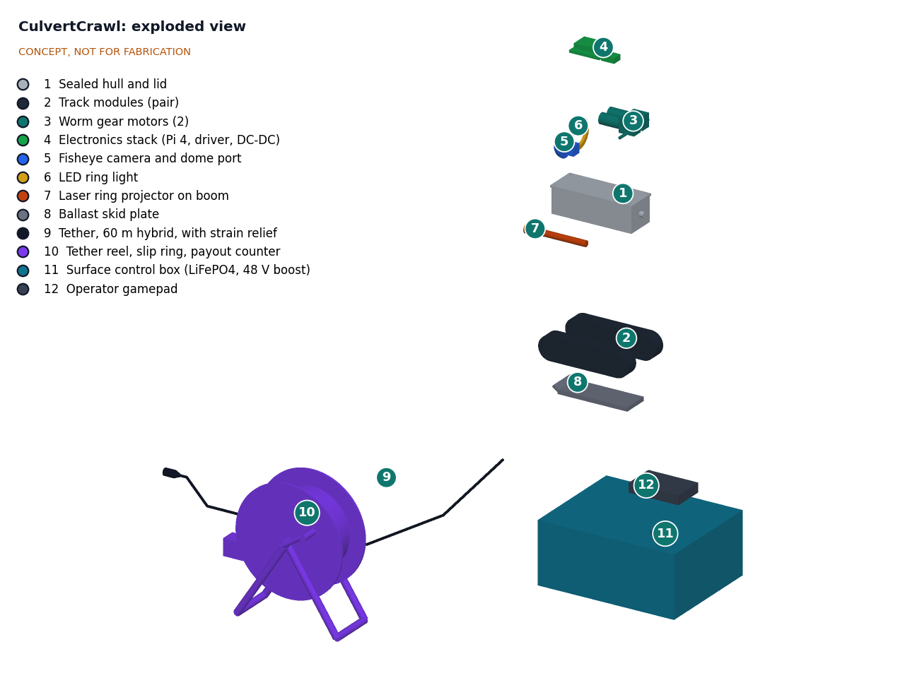
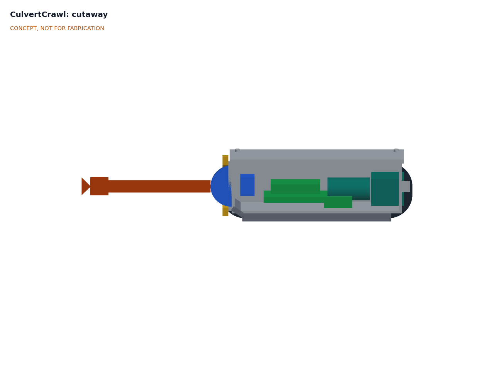

# CulvertCrawl design precis

CulvertCrawl is a small tracked crawler, about 510 x 170 x 106 mm and 5.3 kg, that drives into a 300 to 900 mm culvert on a 60 m tether while an operator watches live video on a laptop at the pipe mouth. A green laser ring projected onto the pipe wall 200 mm ahead of a fisheye camera gives a cross-section every 6 mm of travel, from which the software reports diameter, ovality (deflection) and sediment depth against distance. The TRL 3 calculations (CVC-CAL-001) give 6.4 h per charge, profile accuracy of 0.35 % and 0.87 % of diameter in 300 and 600 mm pipe, and a parts cost of $901 against the $900 budget. Three requirements are not met on paper: reach falls to about 39 m when the crawler drives submerged and uphill against the flow (R2), accuracy is about 1.6 % at 900 mm (R5), and the cost is $1 over (R12). All numbers are calculated estimates, not measurements.

*Figure 1. CulvertCrawl in a sectioned 600 mm culvert, with the tether reel and surface control box at the mouth and a 1.75 m person for scale. The green line is the projected laser ring (illustrative).*

## How it works

1. **Deploy.** Two people carry the crawler, the tether reel and the surface box from the vehicle to the culvert mouth. The operator connects a laptop and gamepad to the surface box, sets the payout counter to zero at the mouth and lowers the crawler onto the invert.
2. **Power and data.** A 12.8 V LiFePO4 battery in the surface box feeds a boost converter that puts 48 V DC on two power conductors in the tether. Two twisted pairs in the same tether carry 100 Mbit/s Ethernet between the laptop and the crawler. A slip ring in the reel hub lets the drum turn while connected. The surface box holds a 10 A fuse at the battery, a 2 A fuse on the 48 V output, a 1.5 A overcurrent cutoff and a latching emergency stop that kills tether power.
3. **Drive.** Inside the sealed aluminium hull, a Raspberry Pi 4 runs the motor driver for two self-locking worm gear motors, one per rubber track. The operator drives with the gamepad at about 0.15 m/s while surveying. The worm gears hold the crawler on a slope with power off.
4. **See.** A 12 MP camera with a 180 degree circular fisheye lens looks forward through an acrylic dome, lit by a ring of eight 1 W LEDs. The Pi encodes the LED frames as 1080p H.264 video at 25 frames per second in hardware and streams it to the laptop, which records it with distance, time and attitude overlaid. Distance comes from the payout counter at the reel, cross-checked by track odometry; pitch and roll come from an IMU in the hull.
5. **Measure.** The camera runs at 50 frames per second; the LEDs light alternate frames for video and the laser ring is captured on the frames between. A Class 2 laser diode at the tip of a clear boom shines onto a 90 degree conical mirror, which spreads the beam into a thin disc of light perpendicular to the crawler axis, 200 mm ahead of the lens. Where the disc meets the wall it draws a bright ring. On the laser frames the LEDs dim and the software finds the ring in the image. Because the ring plane is fixed relative to the camera, each ring pixel defines a ray that meets the plane at exactly one point, so the wall is triangulated in 3D even when the crawler is well below the pipe axis. The software fits a circle and an ellipse to each ring, and reports mean diameter, ovality, and the height of any flat sediment or water surface across the invert, every 6 mm of travel at survey speed.
6. **Recover.** The crawler reverses out while the operator winds the reel. If it stalls or loses power, the tether's aramid strength member lets the crew pull it out by hand; nobody enters the pipe.

*Figure 2. Power flow while driving and profiling, in watts, from CVC-CAL-001. All values are estimates.*

## Main components

Numbers match the exploded view (Figure 3) and `bom/bom.csv`.

| # | Component | Proposed choice | Notes |
| --- | --- | --- | --- |
| 1 | Sealed hull and lid | 6061 aluminium body 240 x 88 x 74 mm, 4 mm walls, 6 mm O-ring lid, IP68 gland, pressure-test port (about 1.09 kg) | Leak check by vacuum or low pressure before each use |
| 2 | Track modules (pair) | Rubber belts about 40 mm wide over 70 mm sprockets, aluminium side plates, 130 mm track spacing | Outer track edges bear on the curved invert |
| 3 | Worm gear motors (2) | 12 V, about 80 rpm output, rated 1 N·m or more (0.67 N·m needed), self-locking, Hall encoders, double lip shaft seals | Shaft seals are the main leak path |
| 4 | Electronics stack | Raspberry Pi 4 Model B 2 GB, dual motor driver, 48 to 12 V and 12 to 5 V converters, IMU, leak sensor | Pi 4 chosen for its hardware H.264 encoder |
| 5 | Fisheye camera and dome port | 12 MP IMX708 module with M12 mount at 2304 x 1296 and 50 fps; 180 degree circular fisheye with the image circle inside the sensor height; 60 mm acrylic dome centered on the lens | Dome keeps the wide field of view if the port is wet |
| 6 | LED ring light | 8 x 1 W high-CRI white LEDs, about 800 lm (estimate), dimmable | Dimmed on laser frames |
| 7 | Laser ring projector | Class 2 (1 mW or less) 520 nm diode, 90 degree conical mirror, clear boom 200 mm ahead of the lens | Removable boom for tight or bent pipes: proposed, awaiting Amish |
| 8 | Ballast skid plate | Steel 210 x 80 x 12 mm, about 1.67 kg, turned-up front lip | Raises traction and protects the hull |
| 9 | Tether | 60 m hybrid: 2 twisted pairs plus 2 x 0.75 mm² power, aramid member, PU jacket about 7 mm, about 55 g/m (estimate) | Also the recovery line |
| 10 | Tether reel | 320 mm flanged reel, A-frame, crank and brake, Ethernet-rated slip ring, payout encoder wheel | Payout counter gives distance |
| 11 | Surface control box | Rugged case; 12.8 V 20 Ah LiFePO4 with BMS; 12 to 48 V boost; 10 A and 2 A fuses; emergency stop; 1.5 A overcurrent cutoff | Laptop connects by Ethernet |
| 12 | Operator gamepad | USB gamepad | Laptop is the user's own |

*Figure 3. Exploded view with numbered callouts matching the BOM. The surface kit (9 to 12) is shown displaced in front of the crawler.*

*Figure 4. Cutaway of the crawler along its axis: dome and camera, electronics stack, worm gear motors at the rear, ballast plate underneath, and the laser boom ahead of the dome.*

The parametric build123d model is `cad/src/model.py` (STEP and STL in `cad/step/` and `cad/stl/`), and the general arrangement is drawing CVC-DWG-001 Rev P1 (`cad/drawings/CVC-DWG-001.pdf`).

## Key numbers (from CVC-CAL-001)

This section summarizes the TRL 3 calculation note, CVC-CAL-001 (`docs/04-calcs/01-sizing.md`); every value is printed by `docs/04-calcs/sizing.py`. The design case is a straight 600 mm corrugated steel culvert, 50 m long, on a 5 % slope, with a wet silt invert and 150 mm of water at 0.5 m/s.

### Mass and buoyancy

| Item | Value | Basis |
| --- | --- | --- |
| Crawler | 5.31 kg | Hull 1.09 kg and ballast 1.67 kg from model volumes; other parts estimated |
| Displaced volume | 2.64 L | Hull envelope, dome, tracks, ballast, boom |
| Net weight fully submerged | 2.66 kg | Half the dry normal load |
| Design case | Fully submerged | 138 mm of water above the track contact line against a 106 mm crawler |
| Whole kit | 17.6 kg; heaviest case 6.3 kg | R10 met on mass |

### Traction and reach

Reach is the tether length whose drag uses up the traction left after track resistance, grade and water drag, with 20 % traction reserve. Driving uphill also lifts the tether up the grade, which the TRL 2 estimate left out.

| Case | Reach | Requirement |
| --- | --- | --- |
| Dry, uphill | 52 m | Met, thin margin |
| Dry, downhill | 85 m | Met |
| Design case: submerged, uphill against 0.5 m/s flow | **39 m** | **R2 not met** |
| Design case: submerged, downhill with the flow | 158 m | Met |

The wet result is very sensitive to track friction under water: at 0.45 instead of 0.6, wet uphill reach falls to about 3 m. About 0.40 kg of extra ballast would restore 50 m on paper. Sprocket torque at the dry traction limit is 0.67 N·m per motor; top speed is 0.29 m/s.

### Power and endurance

| Quantity | Value |
| --- | --- |
| Crawler loads; crawler input | 28.0 W; 30.8 W |
| Tether loop resistance (2 x 60 m of 0.75 mm²) | 3.12 Ω |
| Tether current; voltage at the crawler; copper loss | 0.67 A; 45.9 V; 1.40 W (4.4 %) |
| Peak: tether current; drop | 1.25 A; 3.9 V |
| Battery output | 36.0 W |
| **Endurance** | **6.4 h nominal; 5.1 h derated** (R9 met) |

At 24 V the tether would lose 8.24 W. The peak battery current of 5.4 A exceeds the 5 A fuse listed at TRL 2, so the fuses are now 10 A at the battery and 2 A on the 48 V output.

### Laser ring profiling

The ring plane sits 200 mm ahead of the dome center. With the camera 70 mm above the invert of a 900 mm pipe, the top of the pipe is 76.5 degrees off the camera axis, beyond the vertical field of a 160 degree lens on a 16:9 frame. The design therefore uses a 180 degree circular fisheye inside the 1296 px sensor height (0.139 degree per pixel). A Monte Carlo of ring centroid noise, lens model residual, ring plane tilt and distance, and crawler yaw gives, at the 95th percentile:

| Pipe | Vertical diameter error | R5 (1 % of diameter) |
| --- | --- | --- |
| 300 mm | 0.35 % | Met |
| 600 mm (150 mm of water) | 0.87 % | Met, thin margin |
| 900 mm (150 mm of water) | 1.59 % | **Not met** |

Moving the ring plane to 300 mm ahead gives 0.97 % at 900 mm (proposed, awaiting Amish). The profile covers only the wall above any water surface, because the light refracts at the water line; the software reports the water or sediment chord instead. At 25 profiles per second, the spacing is 6 mm at 0.15 m/s. A 1 mW ring gives about 272 signal electrons per pixel on the wall of a 900 mm pipe, enough in a dark pipe.

### Cost

| Group | Cost | Requirement |
| --- | --- | --- |
| Crawler (items 1 to 8) | $421 | |
| Tether, reel and surface kit (items 9 to 12) | $450 | |
| Hardware and consumables (item 13) | $30 | |
| **Total** | **$901** | R12 ($900) not met by $1 |

The laptop is excluded.

## Key design choices

Amish decided items 1 to 8 of the TRL 2 review on 2026-09-25 by accepting the recommendations (CVC-DDR-001).

- **Tracks rather than wheels.** Tracks spread the load on silt and ride over corrugations and joint offsets. Decided by Amish, 2026-09-25: go with recommendation.
- **Power from the surface over the tether at 48 V DC, with no battery in the crawler.** Surface power keeps lithium cells out of the pipe and the crawler small. At 48 V the tether loses 4.4 %; at 24 V it would lose about six times as much. 48 V stays below the 60 V DC extra-low-voltage limit. Decided by Amish, 2026-09-25: go with recommendation.
- **Surface battery: 12.8 V 20 Ah LiFePO4 rather than a SwapCell pack.** A SwapCell-compatible input stays a later option; it would cite SwapCell interface v0.3, whose wake on a coded INTERLOCK loop needs no CAN host. Decided by Amish, 2026-09-25: go with recommendation.
- **Laser ring ahead of a fixed fisheye camera,** Class 2, 520 nm, rather than structured light, stereo or a pan-tilt head. Decided by Amish, 2026-09-25: go with recommendation.
- **Processing on the laptop.** The Pi streams video and sensor data; ring extraction and reports run on the operator's laptop. Decided by Amish, 2026-09-25: go with recommendation.
- **Pipe range 300 to 900 mm.** Kept, with the 900 mm case checked at TRL 3 (R5 not met at 900 mm). Decided by Amish, 2026-09-25: go with recommendation.
- **Budget $900.** Decided by Amish, 2026-09-25: go with recommendation.
- **Removable laser boom.** Proposed, awaiting Amish (no recommendation was made at TRL 2).
- **Camera at 50 frames per second with a circular fisheye.** A TRL 3 engineering choice so that video (R4) and profiling (R5) are both met from one camera; recorded in CVC-CAL-001.

## Safety

> **Safety:** CulvertCrawl is used at roadside ditches, next to flowing water and at the mouth of a confined space. It carries a lithium battery, 48 V DC on a long cable, a laser and moving tracks. The most important rule is that nobody enters the pipe, including to recover a stuck crawler.

- **Confined space.** A culvert is a confined space and may be a permit-required confined space under OSHA 29 CFR 1910.146 ([osha.gov](https://www.osha.gov/laws-regs/regulations/standardnumber/1910/1910.146)). The purpose of CulvertCrawl is to avoid entry. Never enter or lean into a pipe to free the crawler; pull it out by the tether, or leave it and call a qualified entry team.
- **Hazardous atmospheres.** The crawler is not intrinsically safe and is not rated for flammable atmospheres. Do not use it in sanitary sewers, in storm drains that may receive sewage or fuel, or anywhere methane or other flammable gas may be present. In any enclosed drain, check the air at the mouth with a four-gas monitor before and during work.
- **Traffic, water and banks.** Road culverts put crews on shoulders and steep, wet banks. Use temporary traffic control as the road owner requires (for example MUTCD Part 6 in the United States), high-visibility clothing and a second person as spotter. Do not work in fast or rising water; flash floods can arrive with little warning.
- **Lithium battery.** The surface box holds a 12.8 V 20 Ah LiFePO4 battery (about 256 Wh). Use a battery with a BMS, keep the 10 A battery fuse and the 2 A tether fuse, charge with a matched LiFePO4 charger on a non-combustible surface, and do not charge a battery that is damaged, swollen or has been in water.
- **Electrical.** 48 V DC on the tether is extra-low voltage, but a damaged tether in water can still corrode and short. The surface box has fuses, a 1.5 A overcurrent cutoff and a latching emergency stop; inspect the tether jacket before each use and retire damaged lengths.
- **Laser.** The projector must stay at Class 2 (1 mW or less, visible) under IEC 60825-1. Do not stare into the beam or look at it through optics; switch the laser off when the crawler is out of the pipe.
- **Moving parts and tether.** Tracks and sprockets can pinch fingers; the emergency stop removes drive power. Pull a stuck crawler out by hand only; never tie the tether to a vehicle, which can exceed the 1 kN strength member and whip the cable. The reel crank can kick back under tether tension, so use the brake. Keep the tether clear of walkways to avoid trips.
- **Sharp edges and wildlife.** Rusted metal pipe has sharp edges at holes and seams. Wear cut-resistant gloves when handling the tether at the mouth, and watch for snakes, wasps and other animals in and near culverts.

## Open questions

- Reach in the wet, uphill design case is about 39 m and very sensitive to track friction under water. Add ballast, define the design case as entering from the upstream end, or both? Proposed, awaiting Amish (see `docs/REVIEW.md`).
- Will double lip seals on the drive shafts hold IP68, or is a magnetic coupling or a sealed motor pod needed?
- Is a Class 2 laser bright enough near a sunlit mouth or on a reflective wall, or does the camera need a narrowband filter?
- Can a Pi 4 capture at 50 frames per second and run the H.264 and JPEG encoders at once?
- Should the ring plane move to 300 mm ahead to meet R5 at 900 mm? Proposed, awaiting Amish.
- Which outputs do users need first: a PACP-style observation log, FHWA condition ratings, or a deflection report? Proposed, awaiting Amish.

## References

- US Occupational Safety and Health Administration. 29 CFR 1910.146, *Permit-required confined spaces*; and 29 CFR 1926 Subpart AA, *Confined Spaces in Construction*.
- Federal Highway Administration. *Culvert Inspection Manual*. FHWA-IP-86-2, 1986.
- Federal Highway Administration. *Culvert Assessment and Decision-Making Procedures Manual*. FHWA-CFL/TD-10-005, 2010.
- ASTM D2321, *Standard Practice for Underground Installation of Thermoplastic Pipe for Sewers and Other Gravity-Flow Applications*.
- NASSCO. *Pipeline Assessment Certification Program (PACP)*. [nassco.org](https://www.nassco.org).
- Duran, O., K. Althoefer and L. D. Seneviratne. "State of the Art in Sensor Technologies for Sewer Inspection." *IEEE Sensors Journal* 2, no. 2 (2002).
- Duran, O., K. Althoefer and L. D. Seneviratne. "Automated Pipe Defect Detection and Categorization Using Camera/Laser-Based Profiler and Artificial Neural Network." *IEEE Transactions on Automation Science and Engineering* 4, no. 1 (2007).
- IEC 60825-1, *Safety of laser products, Part 1: Equipment classification and requirements*.
- IEC 60529, *Degrees of protection provided by enclosures (IP Code)*.

On 2026-09-25 the OSHA regulation, both FHWA manuals and both Duran papers were confirmed online by title, number and year (the 2007 paper at *IEEE Transactions on Automation Science and Engineering* 4, page 118). The ASTM D2321 deflection clause, NASSCO PACP, IEC 60825-1 and IEC 60529 were not rechecked.
