# CulvertCrawl prototype build plan

**Plan, not yet built.** How to build the first proof-of-concept prototype, component by component. Building and testing to it is TRL 4 work. Decisions still to be made are kept in the design decisions register ([docs/06-design-decisions.md](06-design-decisions.md)), not here.

## 1. What you are building

*Figure 1. The crawler: 16 components, pulled apart and numbered in build order.*

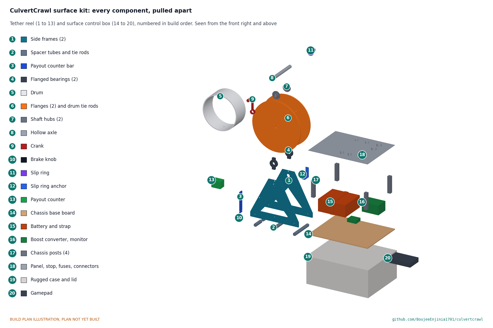

*Figure 2. The surface kit: the tether reel (1 to 13) and the surface control box (14 to 20).*

The prototype is a small tracked crawler, 611 mm long, 170 mm wide and 106 mm high, on a 60 m tether, with a hand-wound tether reel and a surface control box. The crawler is a sealed aluminium box on a steel skid plate, driven by two worm gear motors through rubber tracks; a fisheye camera looks forward through an acrylic dome, ringed by eight LEDs, and a laser at the end of a clear boom throws a ring of light onto the pipe wall 300 mm ahead. The box at the surface holds the battery, the 48 V supply, the fuses and the emergency stop. Most of the structure is made: the hull and lid are machined from aluminium block and plate, the ballast plate is cut and drilled from steel bar, the side plates, tray, brackets, reel frames and box panel are cut and drilled from sheet and bar, the boom, fin and window are cut from clear acrylic, the reel drum and flanges are cut from plastic pipe and sheet, and two small parts are 3D printed. Everything else (motors, tracks, camera, electronics, tether, slip ring, case, battery) is bought and fitted. The parts cost about $1,034 from the bill of materials.

Left and right are as seen from behind the crawler, looking the way it drives. Heights on the crawler are up from the track contact line (the flat ground the tracks stand on) unless a step says otherwise. Sizes are in millimetres; workshop tolerance is 0.5 mm unless a step says otherwise.

> **Safety:** The surface box holds a 12.8 V, 20 Ah lithium iron phosphate battery (about 256 Wh) and a 48 V supply. Keep the battery fuse out until section 6 says otherwise, and never charge a battery that is damaged, swollen or has been in water. The laser is Class 2: never look into the beam or through optics at it, and switch it off whenever the crawler is out of a pipe. The tracks and sprockets can trap fingers. Cut aluminium and steel edges are sharp; deburr everything and wear gloves for bar and sheet. Acrylic solvent cement and potting epoxy give off fumes; use them in a ventilated space with gloves and eye protection.

## 2. What changed to make it buildable

The concept showed what the crawler does; some of its parts could not be made or fixed as drawn. Each change below keeps what it does, and all of them are recorded in decision record CVC-DDR-003.

*Table 1. Changes from the concept.*

| Component | The concept had | The buildable design has | Why |
| --- | --- | --- | --- |
| Hull and lid | 4 mm walls; a lid overhanging by 3 mm with nothing to seal on or screw into | A rim 12 mm wide inside the top, with the O-ring groove and ten M4 screws; a flush lid; a 10 mm front wall (Figures 3, 4 and 5) | A 4 mm wall cannot carry both an O-ring groove and a tapped hole |
| Tracks | 40 mm belts 1 mm from the hull; side plates overlapping the hull walls, with no fixing | 36 mm belts with the same outer edge; made 3 mm side plates flat on the hull and ballast plate (Figures 10 and 11) | Room for a plate between hull and belt, without changing the crawler's width |
| Motors | Gearboxes through the rear wall; no fixing; no seal housing | Gearbox faces on drive pads inside the side walls, two screws each; lip seals in counterbores in the walls (Figure 11) | The motors are held by their own tapped faces; the seals are kept in by the side plates |
| Electronics | A converter block inside the motors; nothing fixed | A tray on four floor pads; the Pi on spacers; a deck on standoffs above it (Figure 14) | Everything fits and is screwed down |
| Camera and lights | Camera behind a solid wall; dome and LED ring floating | A bored front wall, a printed camera mount, and a machined bezel that clamps the dome and holds eight potted LEDs (Figure 18) | The dome is sealed on an O-ring; stock LED boards |
| Laser boom | Touching the dome tip at a point, with no fixing and no wire path | Carried on a clear acrylic fin bolted to a bracket on the ballast plate's nose (Figures 20 and 22) | The camera sees the fin edge on; the ring is still measured to within 1 % of diameter |
| Laser head | A bare cone mirror with nothing holding it | A clear window tube and an end cap hold the mirror (Figure 25) | The ring leaves through the window, still 300 mm ahead |
| Ballast plate | 230 x 80 mm, no fixing, a bent 14 mm lip | 255 x 88 mm, square nose, tapped for the side plates, fin bracket and eye bolt (Figure 8) | It is now the crawler's base, tied to the hull by the side plates |
| Tether | No anchor for the strength member; gland in the way of the gearboxes | An eye bolt in the ballast plate takes the pull; a penetrator 77 mm up seals the cable (Figure 9) | Recovery pulls go to steel, not to a seal |
| Reel | Tubes clashing with the flanges; no bearings; a counter floating in the air | Plate side frames on spacer tubes, bearings, a hollow axle, a drum clamped between flanges, a brake, a slip ring anchor and a counter bar (Figures 26 to 35) | Every part cut, drilled or bought, the 320 mm reel size kept |
| Surface box | A battery taller than the case; nothing fixed | A drop-in chassis: base board, four posts and a panel; the case is not drilled (Figures 36 to 38) | The case stays waterproof and the chassis lifts out |
| Mass | 5.8 kg crawler | 6.6 kg crawler; 22.2 kg kit | The added rim, pads, plates and frames; the requirements are still met |

## 3. Making the components

Make and check each component before the assembly step that needs it. The crawler comes first (3.1 to 3.13), then the reel (3.14 to 3.19) and the surface box (3.20 to 3.22). On the reel, the left frame is the crank side and the right frame the slip ring side.

### 3.1 Hull body

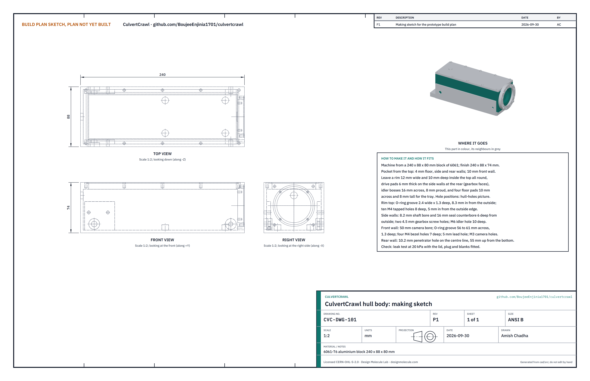

*Figure 3. Hull body making sketch (CVC-DWG-101).*

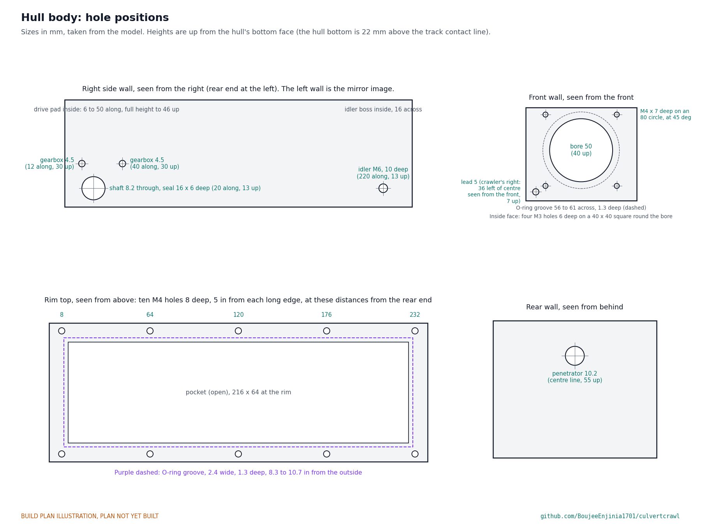

*Figure 4. Every hole in the hull walls and rim, from the model. Heights on this figure are up from the hull's bottom face.*

**What it is and what it is made from.** The sealed box that holds the motors, the electronics and the camera. 6061-T6 aluminium, machined from a 240 x 88 x 80 mm block; finished 240 x 88 x 74 mm and about 0.92 kg.

**How to make it.**

1. Face the block to 240 x 88 x 74 mm. This is a job for a CNC mill or a machine shop; the drawing and Figure 4 are what to send.
2. Pocket it from the top, leaving a 4 mm floor and 4 mm side and rear walls, and a 10 mm front wall.
3. Leave these inside the pocket, in one setup: a rim 12 mm wide and 10 mm deep round the top; on each side wall a drive pad 6 mm thick from 6 to 50 mm along from the rear end, up to 46 mm above the bottom; on each side wall an idler boss 16 mm across and 8 mm proud at 220 mm along, 13 mm up; and four floor pads 10 mm across and 8 mm tall, 24 mm each side of the centre line, at 124 and 212 mm from the rear end.
4. Rim top: cut the O-ring groove 2.4 mm wide and 1.3 mm deep, 8.3 mm in from the outside edge all round; drill and tap ten M4 holes 8 mm deep, 5 mm in from each long edge, at 8, 64, 120, 176 and 232 mm from the rear end.
5. Side walls, from outside: an 8.2 mm shaft hole through the wall and pad at 20 mm along and 13 mm up, with a 16 mm counterbore 6 mm deep for the lip seal; two 4.5 mm gearbox screw holes through wall and pad at 12 and 40 mm along, 30 mm up, each with a shallow counterbore for a small O-ring; an M6 tapped hole 10 mm deep into the idler boss.
6. Front wall: a 50 mm bore centred 40 mm up; an O-ring groove 56 to 61 mm across and 1.3 mm deep round it; four M4 holes 7 mm deep on an 80 mm circle at 45 degrees; a 5 mm hole for the potted lead 36 mm to the right of the centre line and 7 mm up; four M3 holes 6 mm deep on the inside face, on a 40 mm square round the bore.
7. Rear wall: a 10.2 mm hole on the centre line, 55 mm up, for the tether penetrator.
8. Floor pads: drill and tap M3, 6 mm deep. Deburr everything; break every outside edge.

**How it fits the parts next to it.** The floor sits flat on the ballast plate; the side plates lie flat on both sides; the lid sits on the rim; the dome and bezel sit on the front wall.

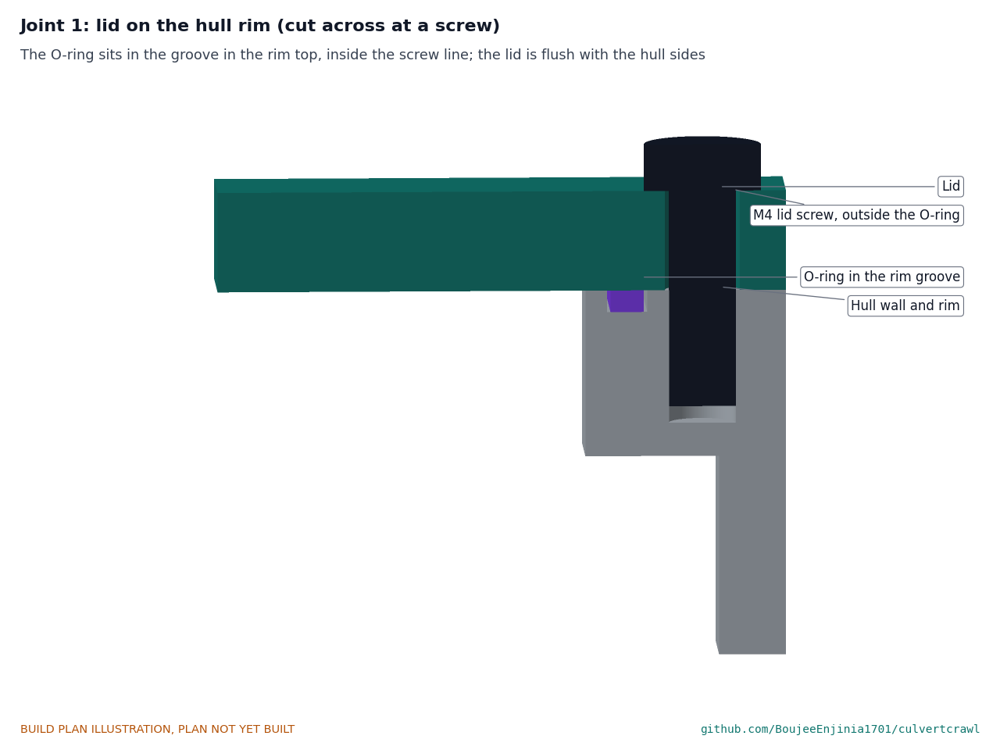

*Figure 5. The O-ring lies in the groove in the rim top, inside the line of lid screws, so no screw hole opens into the sealed space.*

**Check before moving on.** Fit the lid with its O-ring, the test plug, the penetrator with a short cable stub and blanking plugs in the shaft and lead holes, and hold 20 kPa of air for 10 minutes with less than 1 kPa drop.

### 3.2 Hull lid

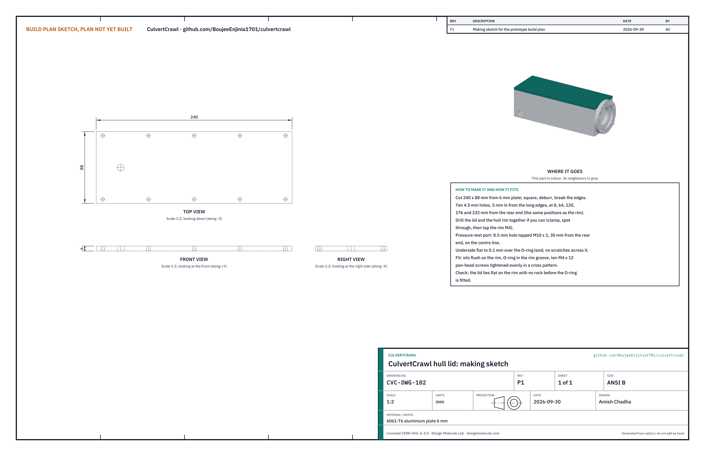

*Figure 6. Hull lid making sketch (CVC-DWG-102).*

**What it is and what it is made from.** The flat top of the hull. 6061-T6 aluminium plate 6 mm, 240 x 88 mm.

**How to make it.**

1. Cut 240 x 88 mm, square it and break the edges.
2. Drill ten 4.5 mm holes 5 mm in from the long edges, at 8, 64, 120, 176 and 232 mm from the rear end. If you can, clamp the lid on the hull and spot through before the rim is tapped.
3. Drill 8.5 mm and tap M10 x 1 on the centre line, 30 mm from the rear end, for the pressure-test plug.
4. Keep the underside flat to 0.1 mm over the O-ring land; no scratches across it.

**How it fits the parts next to it.** It sits flush on the rim (Figure 5), held by ten M4 x 12 pan-head screws tightened evenly in a cross pattern.

**Check before moving on.** The lid lies on the rim with no rock before the O-ring goes in.

### 3.3 Ballast skid plate

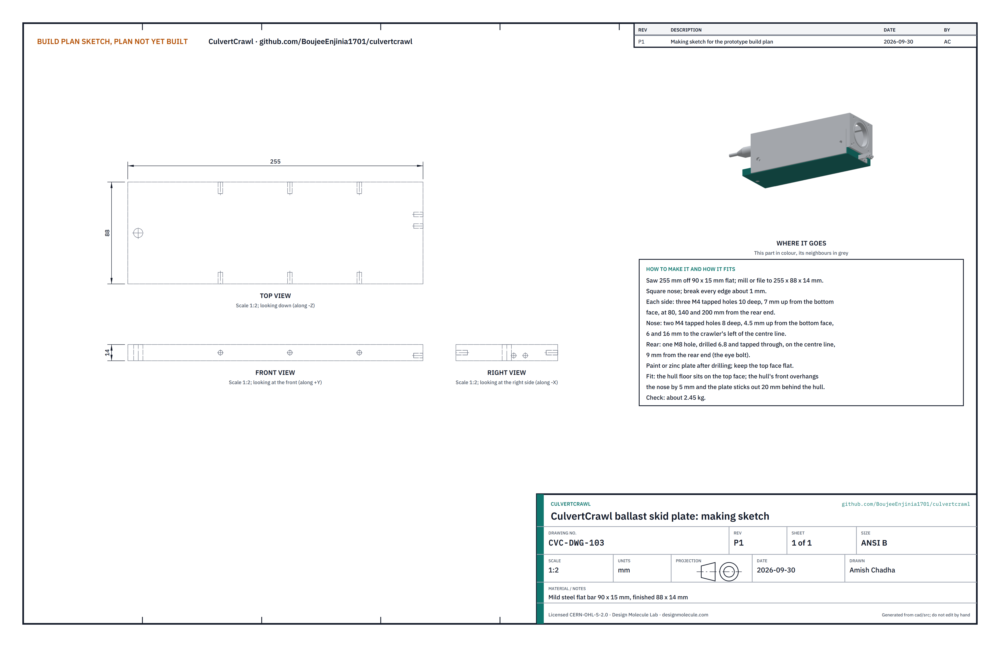

*Figure 7. Ballast plate making sketch (CVC-DWG-103).*

**What it is and what it is made from.** The steel plate the hull sits on. It adds traction, protects the hull and is what the side plates, the fin bracket and the tether's eye bolt fasten to. Mild steel flat bar 90 x 15 mm, finished 255 x 88 x 14 mm, about 2.45 kg.

**How to make it.**

1. Saw 255 mm off the bar; mill or file to 255 x 88 x 14 mm with a square nose. Break every edge about 1 mm.
2. Each side: three M4 holes 10 mm deep, 7 mm up from the bottom face, at 80, 140 and 200 mm from the rear end.
3. Nose: two M4 holes 8 mm deep, 4.5 mm up from the bottom face, 6 and 16 mm left of the centre line.
4. Rear: drill 6.8 mm and tap M8 through, on the centre line, 9 mm from the rear end, for the eye bolt.
5. Paint or zinc plate it after drilling; keep the top face flat.

**How it fits the parts next to it.** The hull sits on its top face with the hull's front 5 mm ahead of the nose; the plate sticks out 20 mm behind the hull for the eye bolt.

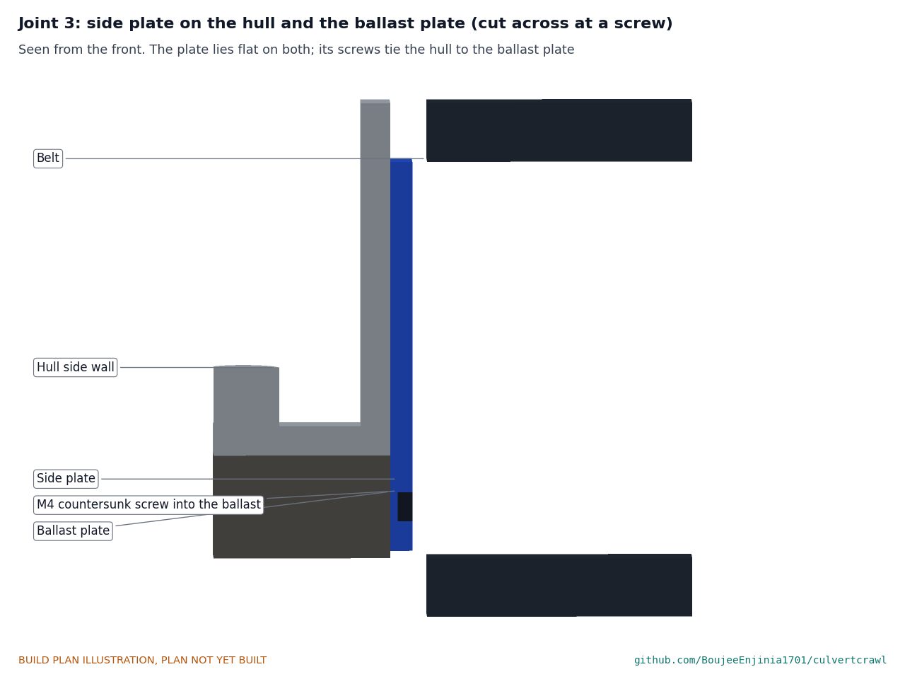

*Figure 8. Each side plate lies flat on the hull side and the ballast side; its countersunk screws into the ballast plate tie the two together. No hole goes through the hull floor.*

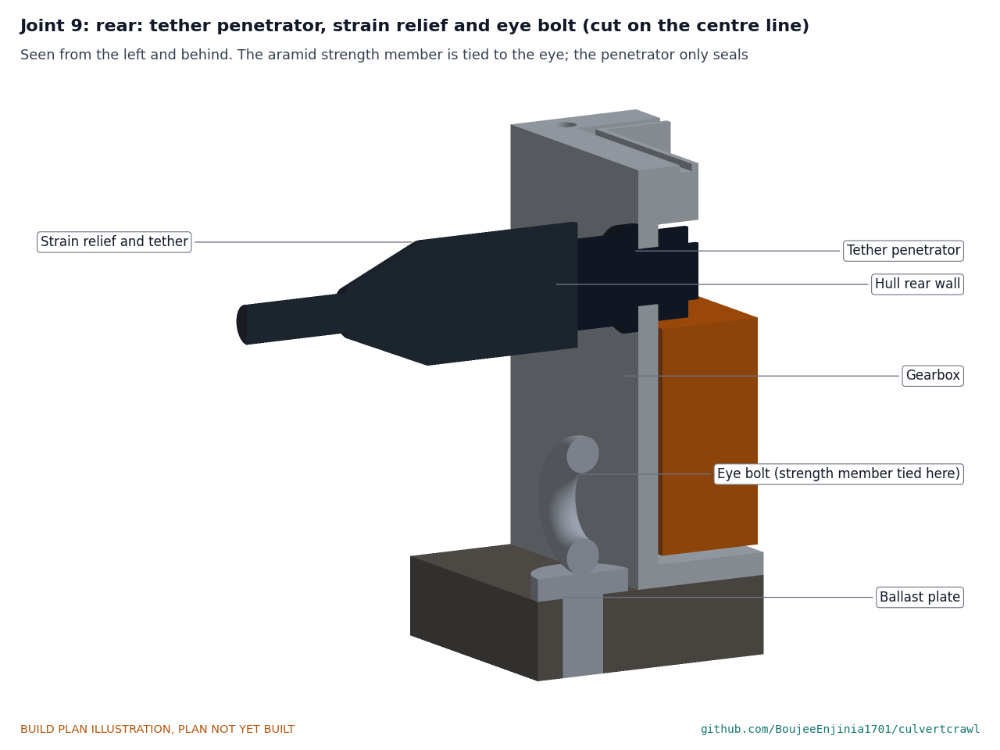

*Figure 9. The tether's strength member is tied to the eye bolt in the ballast plate; the penetrator in the rear wall only seals the cable.*

**Check before moving on.** About 2.45 kg; the hull sits on it without rocking.

### 3.4 Side plates (make 2, a left and a right)

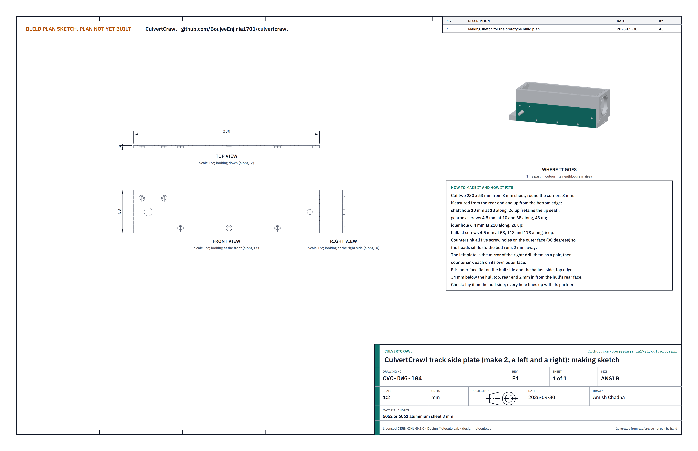

*Figure 10. Side plate making sketch (CVC-DWG-104), the right plate seen from outside.*

**What it is and what it is made from.** A flat plate on each side between the hull and the track belt. It ties the hull to the ballast plate, holds the shaft seal in and takes the motor screws. 5052 or 6061 aluminium sheet 3 mm, 230 x 53 mm.

**How to make it.**

1. Cut two 230 x 53 mm blanks; round the corners 3 mm.
2. Measured from the rear end and up from the bottom edge: a 10 mm shaft hole at 18 along, 26 up; two 4.5 mm gearbox screw holes at 10 and 38 along, 43 up; a 6.4 mm idler hole at 218 along, 26 up; three 4.5 mm ballast screw holes at 58, 118 and 178 along, 6 up.
3. Drill the two plates clamped together, then countersink the five screw holes on each plate's own outer face (90 degrees) so the heads sit flush: the belt runs 2 mm away.

**How it fits the parts next to it.** The inner face lies flat on the hull side and the ballast side, its rear end 2 mm in from the hull's rear face and its top edge 34 mm below the hull top. It is held by the two gearbox screws (Figure 11), the idler axle bolt (Figure 12) and three M4 countersunk screws into the ballast plate (Figure 8).

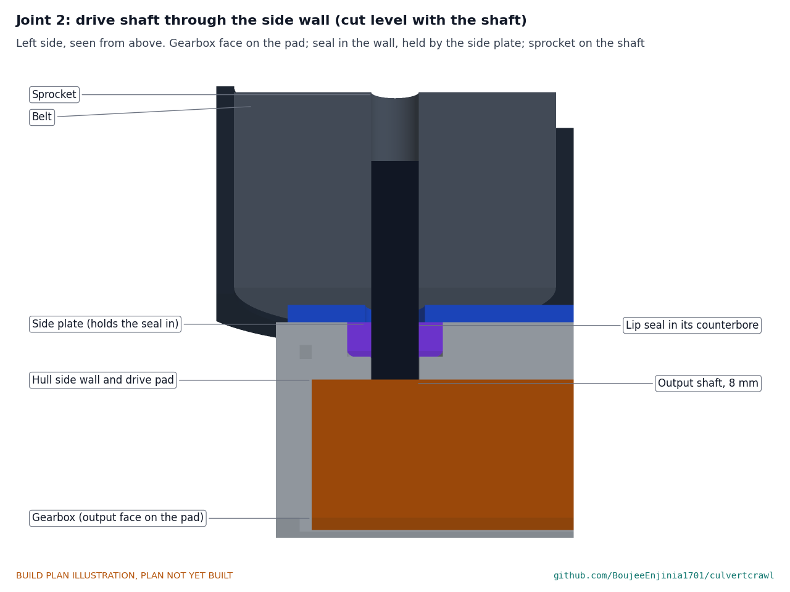

*Figure 11. The gearbox's output face sits on the drive pad; the shaft passes the lip seal in the wall counterbore, which the side plate keeps in; the sprocket sits on the shaft.*

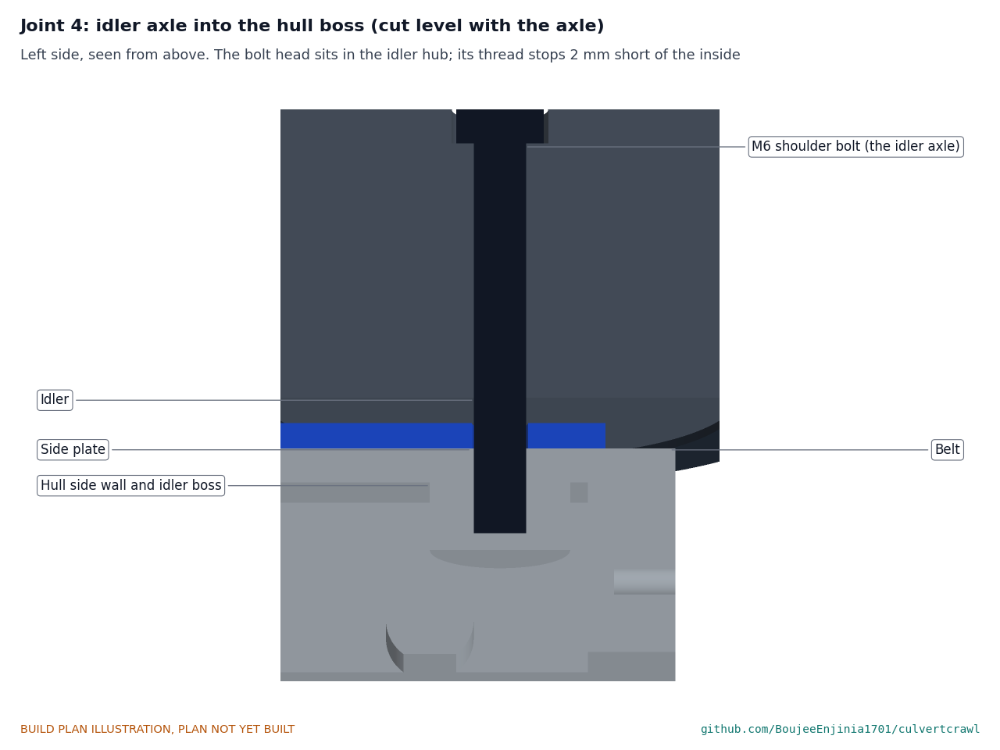

*Figure 12. The idler turns on an M6 shoulder bolt whose head sits in the idler hub and whose thread goes into the blind boss in the hull wall.*

**Check before moving on.** Laid on the hull side, every hole lines up with its partner in the hull and the ballast plate.

### 3.5 Bought drive parts: motors, seals, tracks

**What to buy.** Two 12 V self-locking worm gear motors (5840 class) of about 80 rpm, rated 1 N·m or more, with Hall encoders, an 8 mm D output shaft at least 38 mm long and two tapped holes in the output face. Two 8 x 16 x 5 mm double lip shaft seals. A rubber track kit with 36 mm belts on 70 mm sprockets and idlers at 200 mm centres (the kit's own side plates are not used).

**What to do to them.** Bore each sprocket 8 mm D (or buy it so) with an M4 set screw and file a flat on the shaft for it. Ream each idler to run on an M6 shoulder bolt. Grease the seal lips.

**How they fit.** See Figures 11 and 12, and steps 2, 3 and 5.

### 3.6 Electronics tray and deck

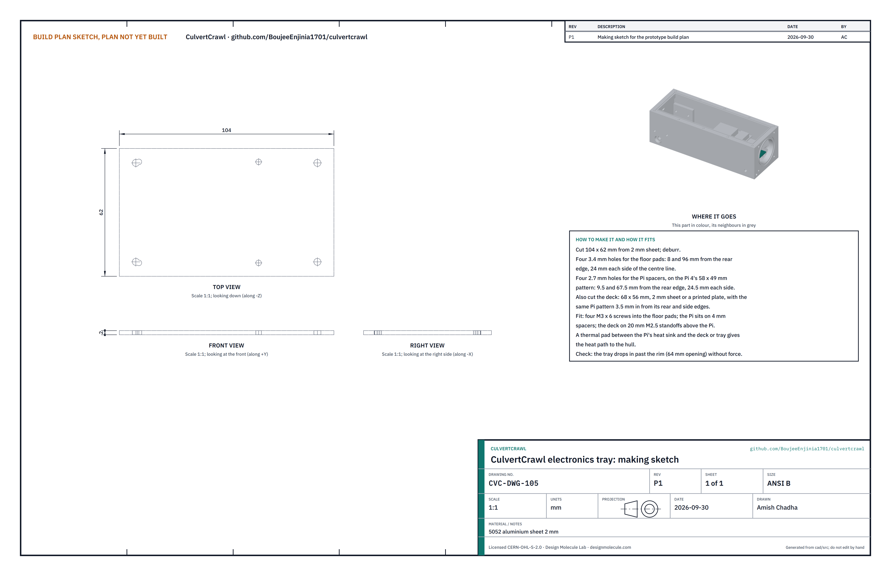

*Figure 13. Electronics tray making sketch (CVC-DWG-105).*

**What it is and what it is made from.** A plate on the floor pads that carries the Raspberry Pi 4, with a deck above the Pi for the motor driver, the converters and the IMU. 5052 aluminium sheet 2 mm.

**How to make it.**

1. Tray: cut 104 x 62 mm. Drill four 3.4 mm holes 8 and 96 mm from the rear edge, 24 mm each side of the centre line (the floor pads), and four 2.7 mm holes on the Pi's 58 x 49 mm pattern, 9.5 and 67.5 mm from the rear edge, 24.5 mm each side.
2. Deck: cut 68 x 56 mm (sheet or a printed plate) with the same Pi pattern 3.5 mm in from its rear and side edges. Lay out the driver, converters and IMU on it and drill their mounting holes through the modules.

**How it fits the parts next to it.** Four M3 x 6 screws hold the tray to the floor pads. The Pi sits on four 4 mm spacers; the deck on four 20 mm M2.5 standoffs above it. A thermal pad between the Pi's heat sink and the tray carries the heat to the hull.

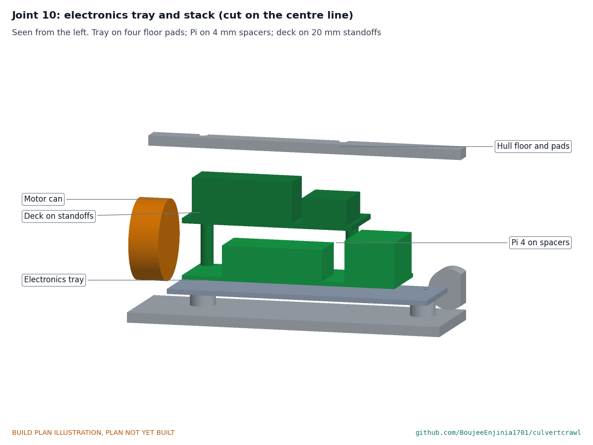

*Figure 14. The tray on its floor pads, the Pi on spacers and the deck on standoffs, 4 mm clear of the motor cans.*

**Check before moving on.** The tray passes the 64 mm opening in the rim without force.

#### 3.6.1 Wiring

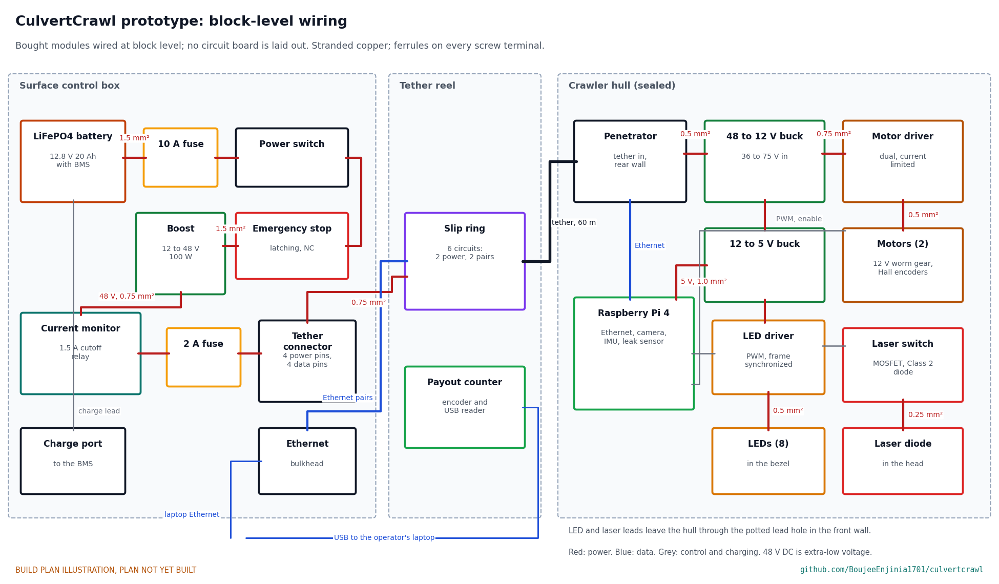

*Figure 15. Block-level wiring with wire sizes, from the battery to the motors, camera, LEDs and laser.*

Wire with stranded copper and a ferrule on every screw terminal, as Figure 15 shows:

1. Battery, through the 10 A fuse, the power switch and the emergency stop's normally closed contact, to the boost converter input: 1.5 mm² (16 AWG).
2. Boost output (48 V) through the current monitor and the 2 A fuse to the tether connector: 0.75 mm².
3. Tether connector to the slip ring stator: two power wires and two Ethernet pairs. Through the hollow axle, the slip ring rotor to the tether's inner end.
4. In the crawler: tether to the 48 to 12 V buck converter, 0.5 mm²; 12 V to the motor driver, 0.75 mm², and to the 12 to 5 V converter; 5 V to the Pi, 1.0 mm²; driver to each motor, 0.5 mm²; motor encoders to the Pi.
5. Tether Ethernet pairs to an RJ45 plug in the Pi's port; the panel's Ethernet bulkhead to the operator's laptop.
6. Pi to the LED driver (frame-synchronized dimming) and to the laser switch; LED and laser leads, 0.5 and 0.25 mm², out through the potted lead hole in the front wall.
7. Payout counter's USB lead to the laptop; the gamepad to the laptop.

Label every wire. Check every connection end to end before any power goes on (section 6).

### 3.7 Camera mount and camera

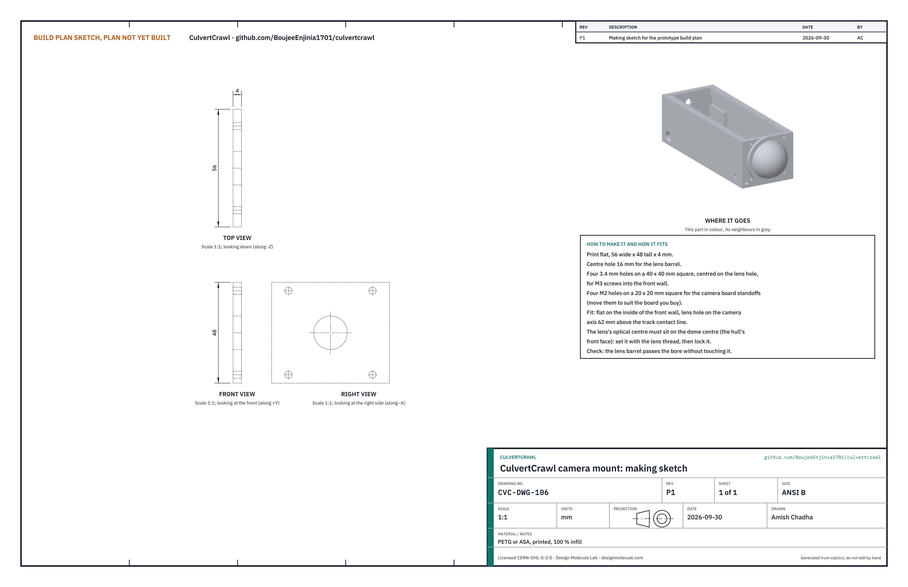

*Figure 16. Camera mount making sketch (CVC-DWG-106).*

**What it is and what it is made from.** A printed plate on the inside of the front wall that holds the camera board so the lens looks through the bore. PETG or ASA, printed flat at 100 % infill, 56 x 48 x 4 mm.

**How to make it.**

1. Print with a 16 mm hole at the centre, four 3.4 mm holes on a 40 mm square round it, and four M2 holes on a 20 mm square for the camera board's standoffs (move these to suit the board you buy).
2. Fit the board on M2 standoffs and the fisheye lens in its holder.

**How it fits the parts next to it.** It lies flat on the inside of the front wall on four M3 screws, its centre on the camera axis 62 mm up. Screw the lens in or out until its optical centre is at the hull's front face (the dome centre), then lock the thread (Figure 18).

**Check before moving on.** The lens barrel clears the bore all round.

### 3.8 Front bezel and LEDs

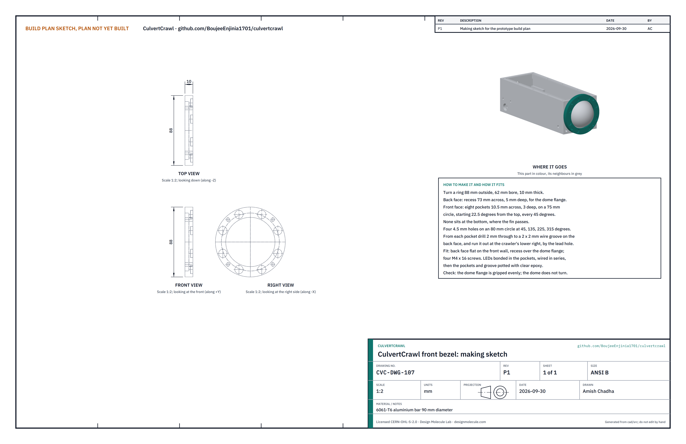

*Figure 17. Front bezel making sketch (CVC-DWG-107).*

**What it is and what it is made from.** A ring on the front of the hull that clamps the dome down on its O-ring and carries the eight LEDs. 6061-T6 aluminium bar 90 mm across.

**How to make it.**

1. Turn a ring 88 mm outside, 62 mm bore, 10 mm thick.
2. Back face: a recess 73 mm across and 5 mm deep for the dome flange.
3. Front face: eight pockets 10.5 mm across and 3 mm deep on a 75 mm circle, the first 22.5 degrees from the top and then every 45 degrees. None sits at the bottom, where the fin passes.
4. Four 4.5 mm holes on an 80 mm circle at 45, 135, 225 and 315 degrees.
5. From each pocket drill 2 mm through to a 2 x 2 mm wire groove on the back face, and run the groove out at the lower right, beside the lead hole in the front wall.
6. Bond an LED on its 10 mm board into each pocket with thermal epoxy, wire them in series through the groove, check they light, then pot the pockets and the groove with clear epoxy.

**How it fits the parts next to it.** The back face lies flat on the front wall with the recess over the dome flange; four M4 x 16 screws clamp it.

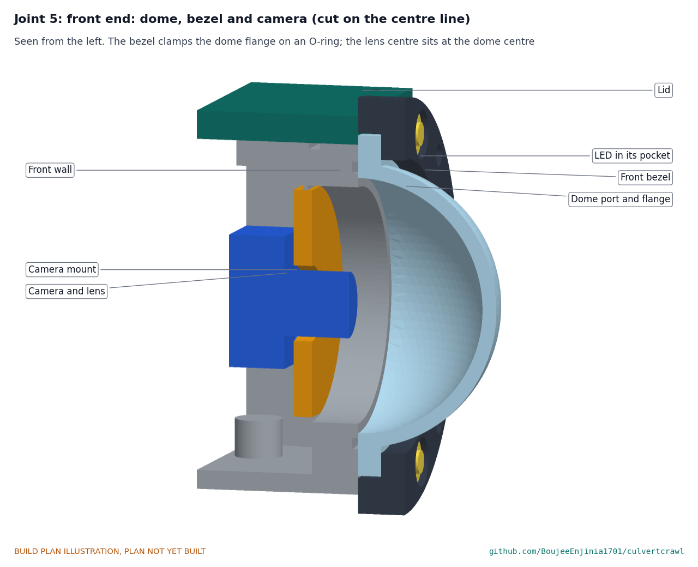

*Figure 18. The bezel clamps the dome flange on the O-ring in the front wall; the camera mount sits on the inside of the wall with the lens centre at the dome centre.*

**Check before moving on.** All eight LEDs light at low current before potting; after fitting, the dome cannot be turned by hand.

### 3.9 Fin bracket

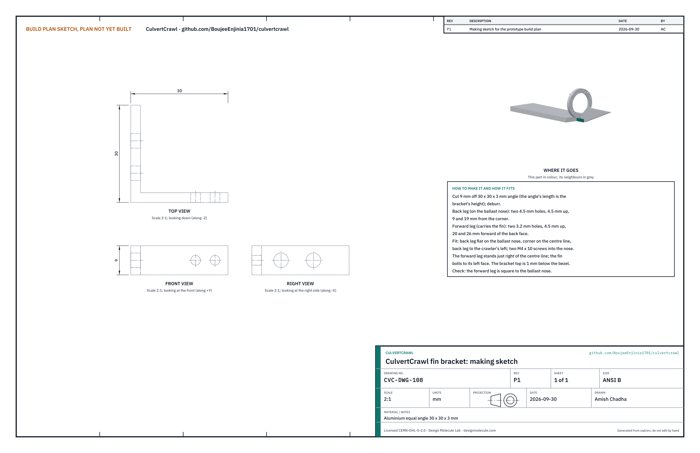

*Figure 19. Fin bracket making sketch (CVC-DWG-108).*

**What it is and what it is made from.** A short angle on the nose of the ballast plate that the boom fin bolts to. Aluminium equal angle 30 x 30 x 3 mm.

**How to make it.**

1. Cut 9 mm off the angle (the angle's length is the bracket's height) and deburr it.
2. Back leg: two 4.5 mm holes 4.5 mm up, 9 and 19 mm from the corner.
3. Forward leg: two 3.2 mm holes 4.5 mm up, 20 and 26 mm forward of the back face.

**How it fits the parts next to it.** The back leg lies flat on the ballast plate's nose, its corner on the centre line and the leg running to the left, on two M4 x 10 screws. The forward leg stands just right of the centre line; the fin bolts to its left face. The bracket's top is 1 mm below the bezel.

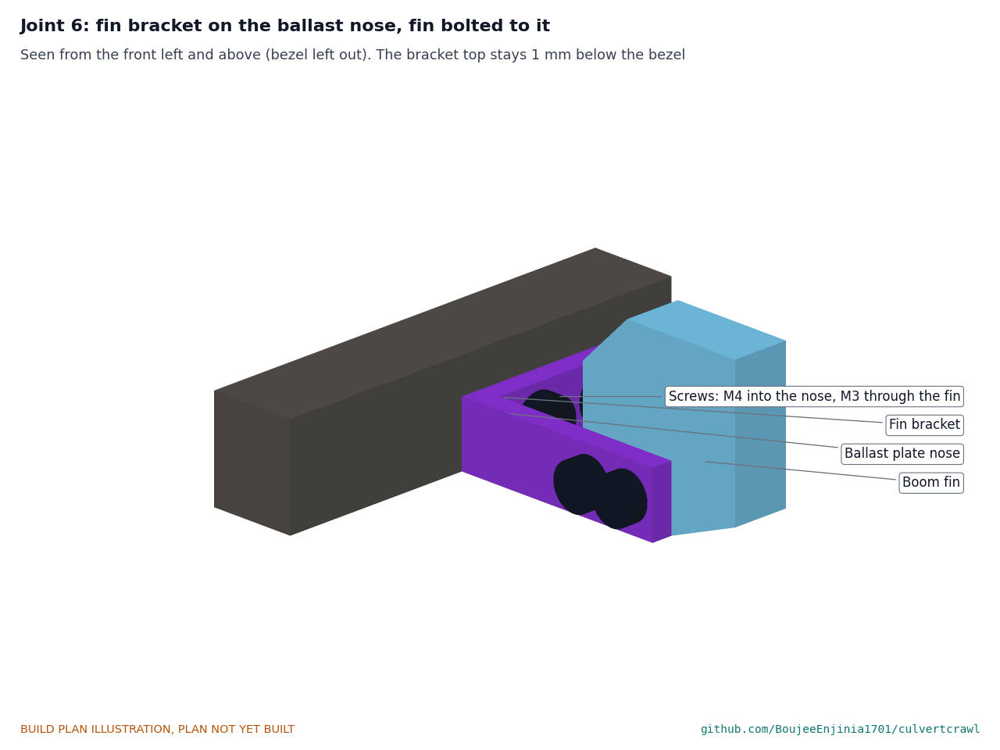

*Figure 20. The bracket on the ballast plate's nose with the fin bolted to it (bezel left out of the picture).*

**Check before moving on.** The forward leg is square to the nose.

### 3.10 Boom fin

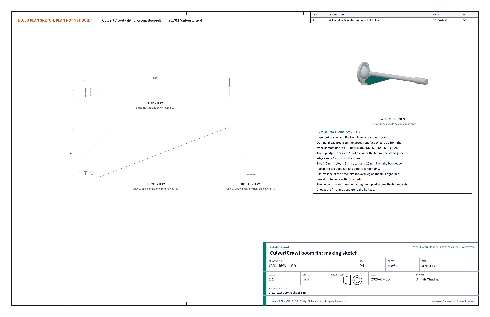

*Figure 21. Boom fin making sketch (CVC-DWG-109).*

**What it is and what it is made from.** A clear plate standing on the bracket that carries the laser boom on the camera axis. Clear cast acrylic sheet 8 mm.

**How to make it.**

1. Laser cut it, or saw and file it. Measured forward from the bezel's front face and up from the track contact line, its corners are at (1, 8), (15, 8), (132, 53), (29, 53) and (1, 25).
2. Two 3.2 mm holes 4.5 mm up, 4 and 10 mm from the back edge.
3. Polish the top edge flat and square for bonding.

**How it fits the parts next to it.** Its right face lies on the bracket's forward leg, held by two M3 x 16 bolts with nyloc nuts. The boom is solvent-welded along its top edge. Its sloping back edge stays 4 mm from the dome.

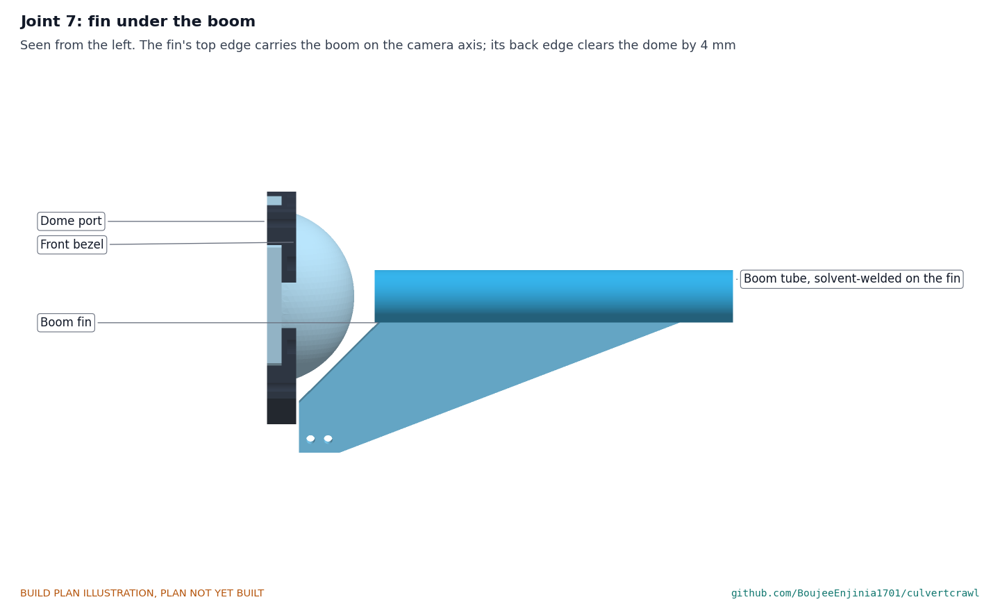

*Figure 22. The fin's top edge carries the boom on the camera axis. The camera sees the fin edge on, so it hides only a thin strip of the ring at the bottom of the pipe.*

**Check before moving on.** The fin stands square to the hull top.

### 3.11 Boom tube

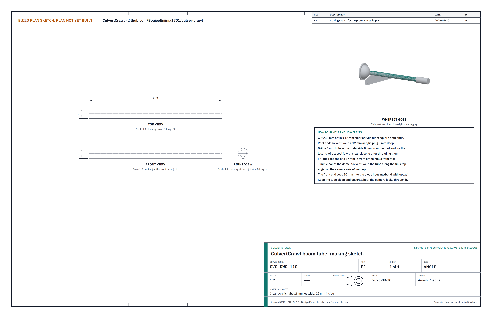

*Figure 23. Boom tube making sketch (CVC-DWG-110).*

**What it is and what it is made from.** The clear tube that holds the laser head 300 mm ahead of the camera. Clear acrylic tube 18 mm outside, 12 mm inside, 233 mm long.

**How to make it.**

1. Cut 233 mm and square both ends.
2. Solvent-weld a 12 mm acrylic plug 3 mm into the root end.
3. Drill a 3 mm hole in the underside 8 mm from the root end for the laser's wires.
4. Thread the laser's leads through the tube before the head is bonded on; seal the 3 mm hole with clear silicone afterwards.

**How it fits the parts next to it.** The root end sits 37 mm in front of the hull's front face, 7 mm clear of the dome, and the tube is solvent-welded along the fin's top edge. Its front end goes 10 mm into the diode housing (Figure 25).

**Check before moving on.** The tube is clean and unscratched; the camera looks through it.

### 3.12 Laser head: diode housing, window and end cap

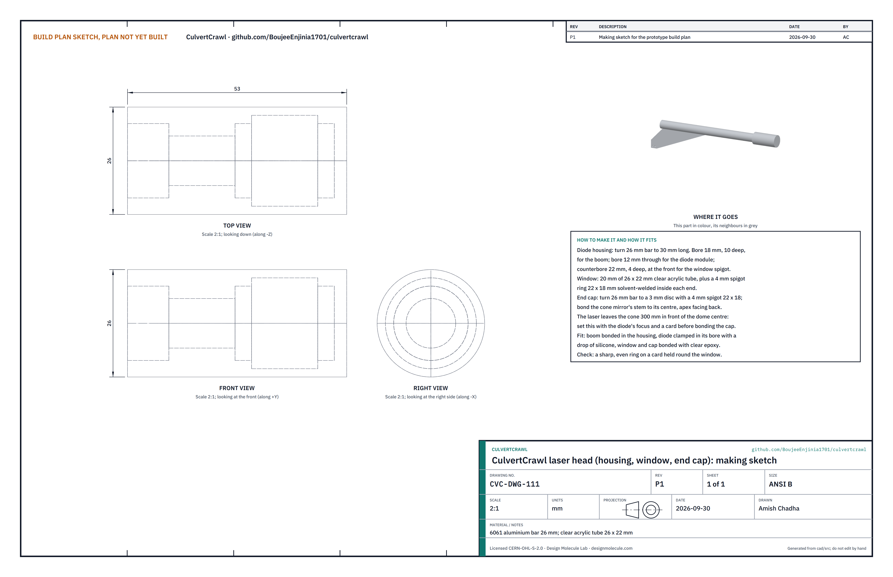

*Figure 24. Laser head making sketch (CVC-DWG-111).*

**What it is and what it is made from.** The head at the end of the boom that turns the laser beam into a disc of light. A machined aluminium housing and end cap (26 mm bar) and a clear acrylic window tube 26 mm outside, 22 mm inside.

**How to make it.**

1. Diode housing: turn 26 mm bar 30 mm long. Bore 18 mm, 10 mm deep, at the back for the boom; bore 12 mm through for the laser module; counterbore 22 mm, 4 mm deep, at the front.
2. Window: cut 20 mm of the tube and solvent-weld a 4 mm spigot ring (22 mm outside, 18 mm inside) into each end.
3. End cap: turn a 3 mm disc 26 mm across with a 4 mm spigot 22 mm outside, 18 mm inside. Bond the cone mirror's stem to its centre with the cone's point facing back.
4. Clamp the laser module in its bore with a drop of silicone. With the diode lit at low power in a dark room, set its focus so the ring on a card held round the window is sharp, and check that the ring leaves the cone 300 mm in front of the hull's front face.
5. Bond the boom into the housing, the window onto the housing and the cap into the window with clear epoxy.

**How it fits the parts next to it.**

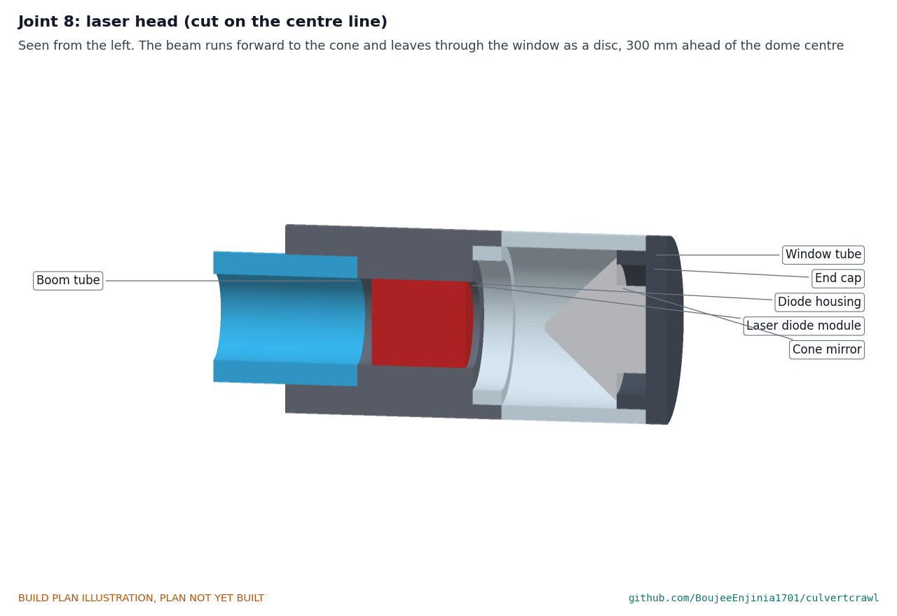

*Figure 25. The beam runs forward to the cone and leaves through the window as a thin disc of light.*

**Check before moving on.** A sharp, even ring all round on a card held round the window.

### 3.13 Bought rear fittings: penetrator, strain relief, eye bolt

**What to buy.** An M10 IP68 cable penetrator (or gland) for 7 mm cable; a bend restrictor for 7 mm cable; an M8 forged eye bolt (DIN 580 class, working load 1.4 kN or more); the 60 m hybrid tether (two twisted pairs, two 0.75 mm² power wires, an aramid strength member of 1 kN or more, about 7 mm across).

**What to do to them.** Strip back the tether's jacket about 150 mm from the crawler end and break the aramid member out; tie it to the eye bolt with a round turn and two half hitches, leaving the cable slack between the eye and the penetrator (Figure 9). Pot the penetrator to the cable as its maker says.

### 3.14 Reel side frames and spacers

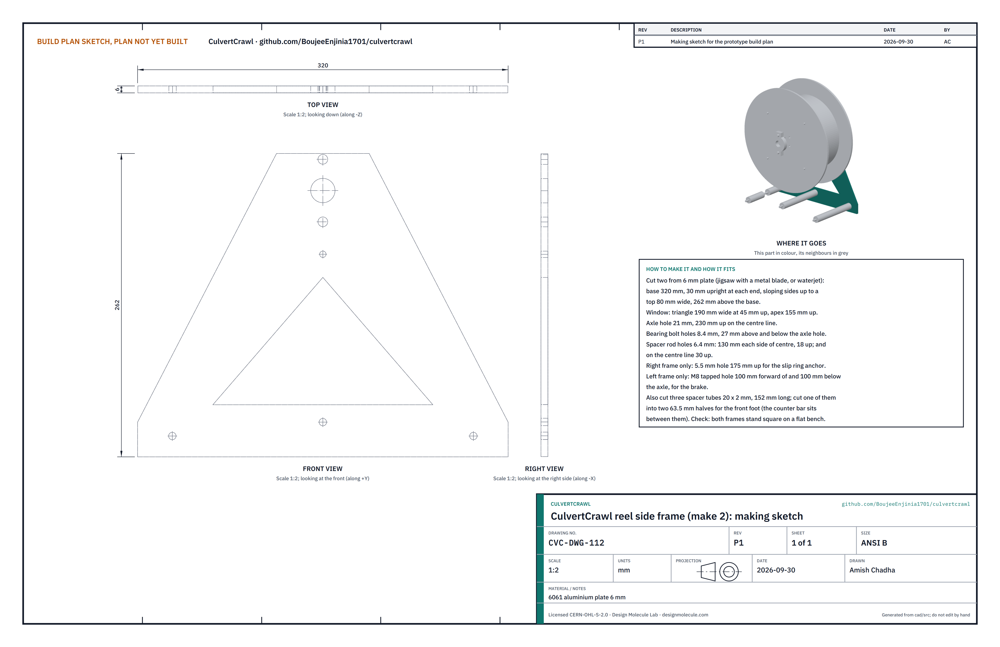

*Figure 26. Reel side frame making sketch (CVC-DWG-112).*

**What it is and what it is made from.** The two A-shaped plates that carry the reel's bearings, joined at the bottom by three spacer tubes. 6061 aluminium plate 6 mm; aluminium tube 20 x 2 mm.

**How to make it.**

1. Cut two frames (jigsaw with a metal blade, or waterjet): base 320 mm, a 30 mm upright at each end, sloping sides up to a top 80 mm wide, 262 mm above the base.
2. Cut the triangular window: 190 mm wide at 45 mm up, its point 155 mm up.
3. Drill a 21 mm axle hole on the centre line 230 mm up, and two 8.4 mm bearing bolt holes 27 mm above and below it.
4. Drill 6.4 mm spacer rod holes 130 mm each side of the centre line, 18 mm up, and on the centre line 30 mm up.
5. Right frame only: a 5.5 mm hole 175 mm up on the centre line for the slip ring anchor. Left frame only: an M8 tapped hole 100 mm toward the counter side and 100 mm below the axle, for the brake.
6. Cut three spacer tubes 152 mm long; cut one of them into two 63.5 mm halves for the front foot (the counter bar fits between them).

**How it fits the parts next to it.** The frames stand 152 mm apart on the spacer tubes, clamped by M6 tie rods with nuts outside. The bearings bolt to their outer faces.

**Check before moving on.** Both frames stand square on a flat bench, and the axle holes line up when you sight through them.

### 3.15 Reel drum

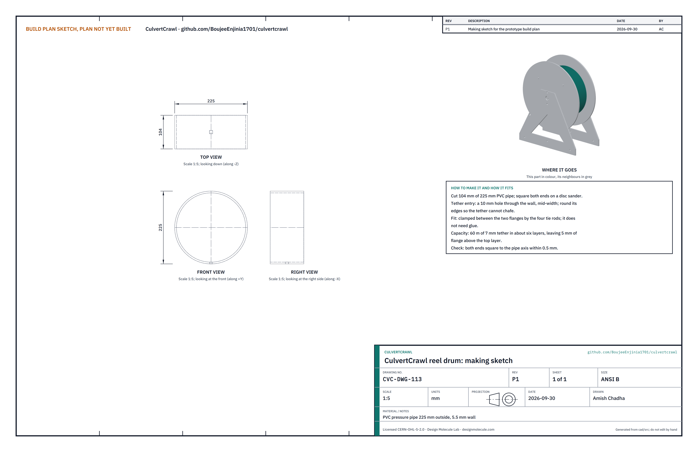

*Figure 27. Reel drum making sketch (CVC-DWG-113).*

**What it is and what it is made from.** The core the tether is wound on. PVC pressure pipe 225 mm outside, 5.5 mm wall, 104 mm long.

**How to make it.**

1. Cut 104 mm and square both ends on a disc sander.
2. Drill a 10 mm hole through the wall at mid-width for the tether's inner end; round its edges so the tether cannot chafe.

**How it fits the parts next to it.** It is clamped between the flanges by the four tie rods; no glue.

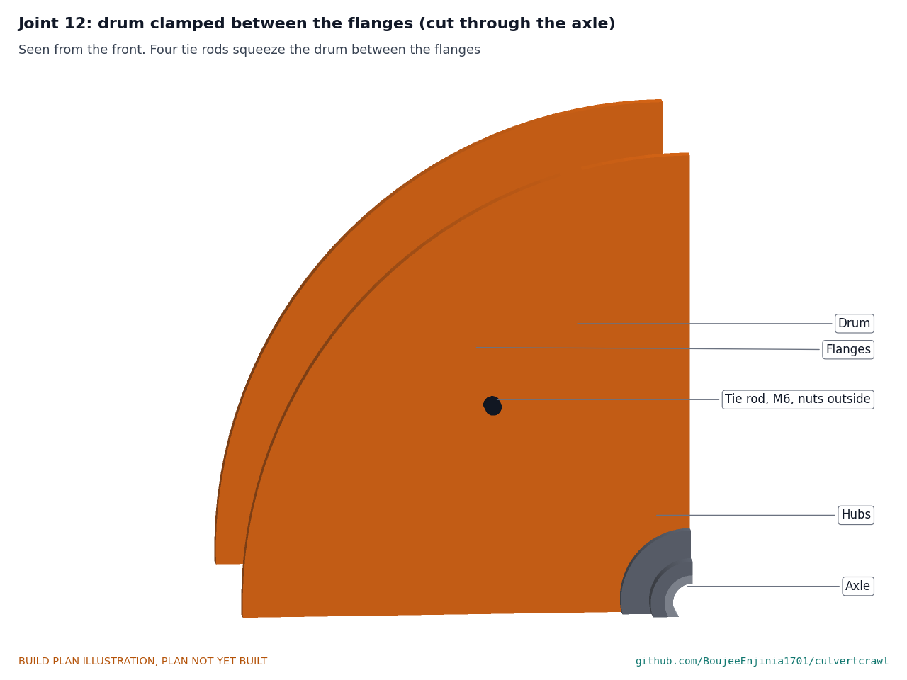

*Figure 28. Four M6 tie rods squeeze the drum between the two flanges.*

**Check before moving on.** Both ends are square to the pipe axis within 0.5 mm. 60 m of tether fills it in about six layers, leaving about 5 mm of flange.

### 3.16 Reel flanges (make 2)

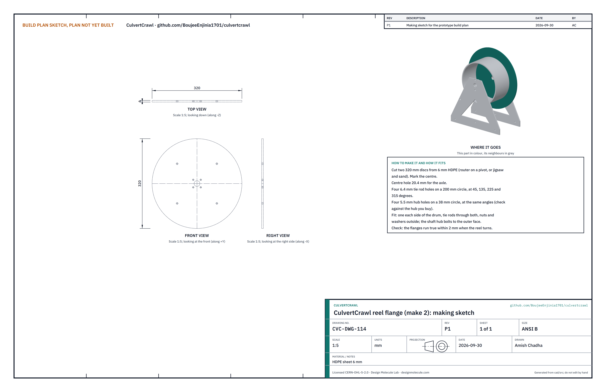

*Figure 29. Reel flange making sketch (CVC-DWG-114).*

**What it is and what it is made from.** The two discs either side of the drum. HDPE sheet 6 mm, 320 mm across.

**How to make it.**

1. Cut two 320 mm discs (a router on a pivot, or a jigsaw and sander).
2. Drill a 20.4 mm centre hole, four 6.4 mm tie rod holes on a 200 mm circle and four 5.5 mm hub holes on a 38 mm circle, both sets at 45, 135, 225 and 315 degrees. Check the hub holes against the hub you buy.

**How it fits the parts next to it.** One each side of the drum on the tie rods; a shaft hub bolts to each flange's outer face and grips the axle.

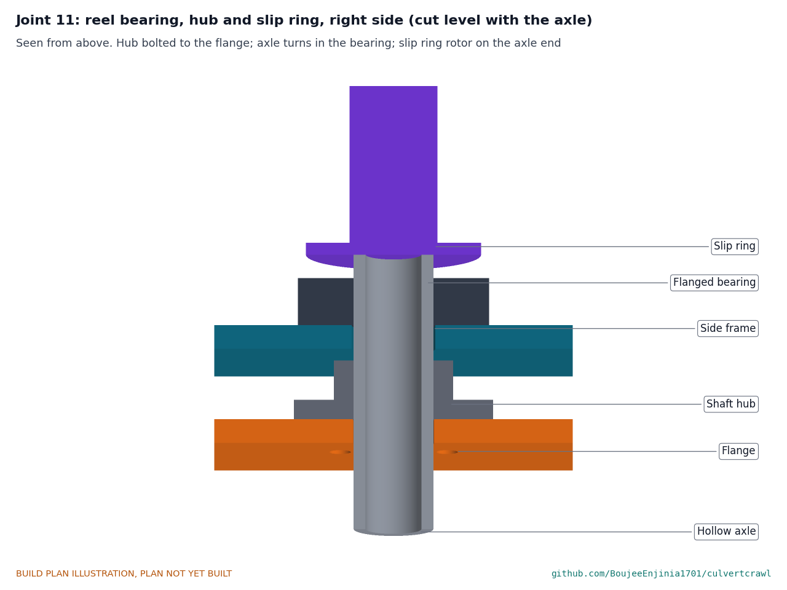

*Figure 30. The hub is bolted to the flange and set-screwed to the axle; the axle turns in the flanged bearing on the side frame; the slip ring's rotor is on the axle end.*

**Check before moving on.** The flanges run true within 2 mm when the reel turns.

### 3.17 Crank and brake

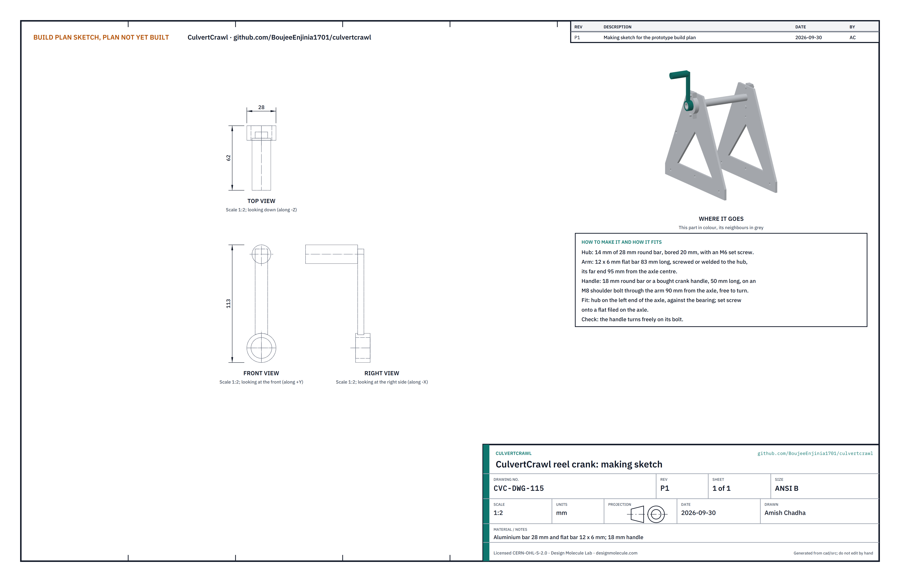

*Figure 31. Crank making sketch (CVC-DWG-115).*

**What it is and what it is made from.** The handle that winds the reel, on the left end of the axle. Aluminium bar 28 mm, flat bar 12 x 6 mm and an 18 mm handle.

**How to make it.**

1. Hub: 14 mm of 28 mm bar, bored 20 mm, with an M6 set screw.
2. Arm: 12 x 6 mm flat bar 83 mm long, screwed or welded to the hub, its end 95 mm from the axle centre.
3. Handle: 18 mm bar or a bought crank handle 50 mm long on an M8 shoulder bolt through the arm, 90 mm from the axle, free to turn.

**How it fits the parts next to it.** The hub sits on the left end of the axle against the bearing, its set screw on a flat filed on the axle. The brake is a bought M8 star-knob screw with a nylon pad on its end, screwed through the left frame so the pad presses on the flange.

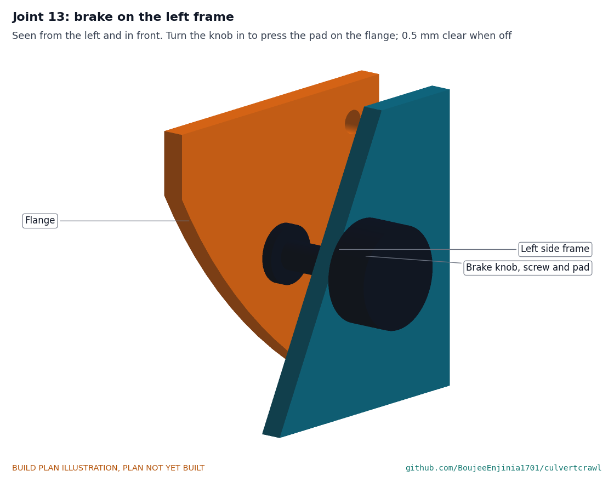

*Figure 32. Turning the knob in presses the pad on the flange; backed off, it is 0.5 mm clear.*

**Check before moving on.** The handle turns freely on its bolt; the brake holds the reel against a firm pull on the tether.

### 3.18 Slip ring anchor bracket

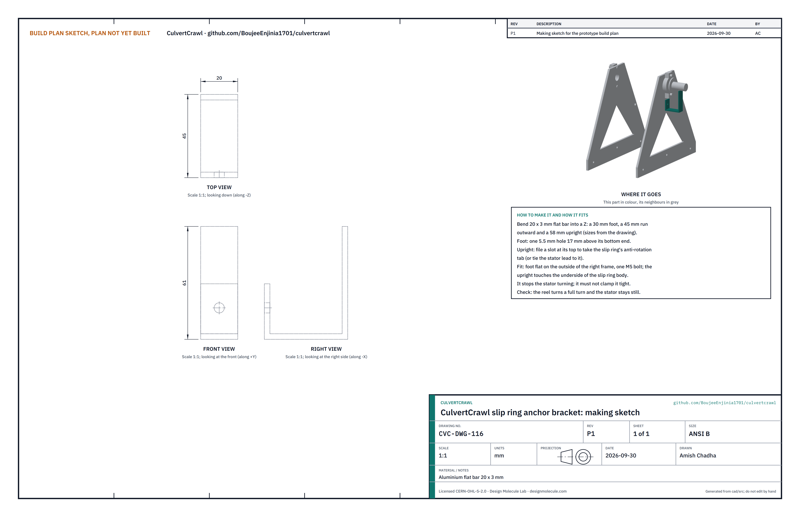

*Figure 33. Slip ring anchor making sketch (CVC-DWG-116).*

**What it is and what it is made from.** A small bent strap that stops the slip ring's outer body turning with the reel. Aluminium flat bar 20 x 3 mm.

**How to make it.**

1. Bend it into a Z: a 30 mm foot, a 45 mm run outward and a 58 mm upright.
2. Drill a 5.5 mm hole in the foot 17 mm above its bottom end.
3. File a slot in the top of the upright to take the slip ring's anti-rotation tab, or tie its stator lead to it.

**How it fits the parts next to it.** The foot lies flat on the outside of the right frame on one M5 bolt; the upright touches the underside of the slip ring body. It stops the body turning without clamping it.

**Check before moving on.** Turn the reel a full turn: the slip ring body stays still.

### 3.19 Payout counter bar

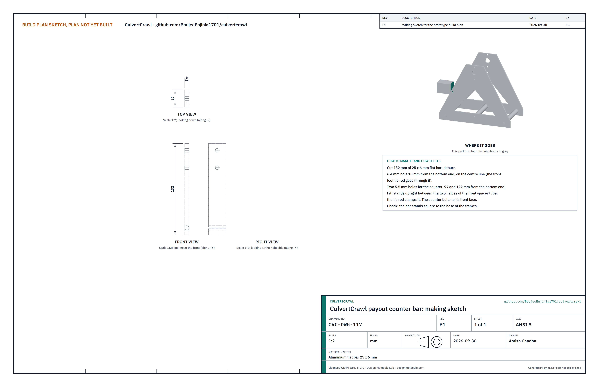

*Figure 34. Payout counter bar making sketch (CVC-DWG-117).*

**What it is and what it is made from.** An upright bar at the front of the reel frame that carries the payout counter where the tether runs off the drum. Aluminium flat bar 25 x 6 mm, 132 mm long.

**How to make it.**

1. Cut 132 mm and deburr it.
2. Drill a 6.4 mm hole 10 mm from the bottom end for the front tie rod, and two 5.5 mm holes 97 and 122 mm from the bottom end for the counter.

**How it fits the parts next to it.** It stands between the two halves of the front spacer tube and the tie rod clamps it. The counter (a bought 50 mm wheel with a 600-count encoder, a pinch roller and a small USB encoder reader in one box) bolts to its front face.

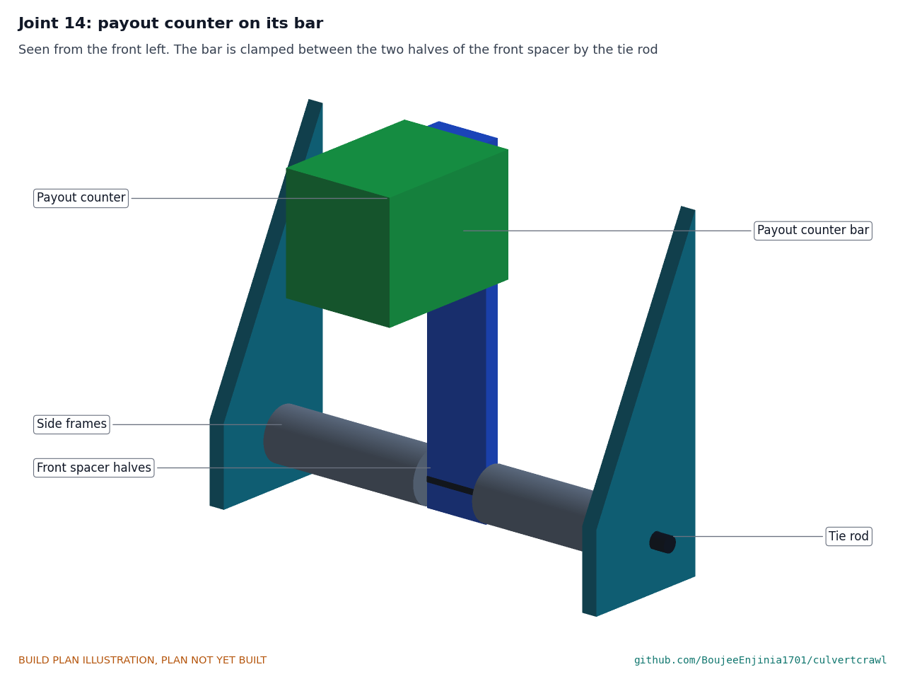

*Figure 35. The bar is clamped between the two halves of the front spacer.*

**Check before moving on.** The bar stands square to the frames' base.

### 3.20 Surface box chassis: base board and posts

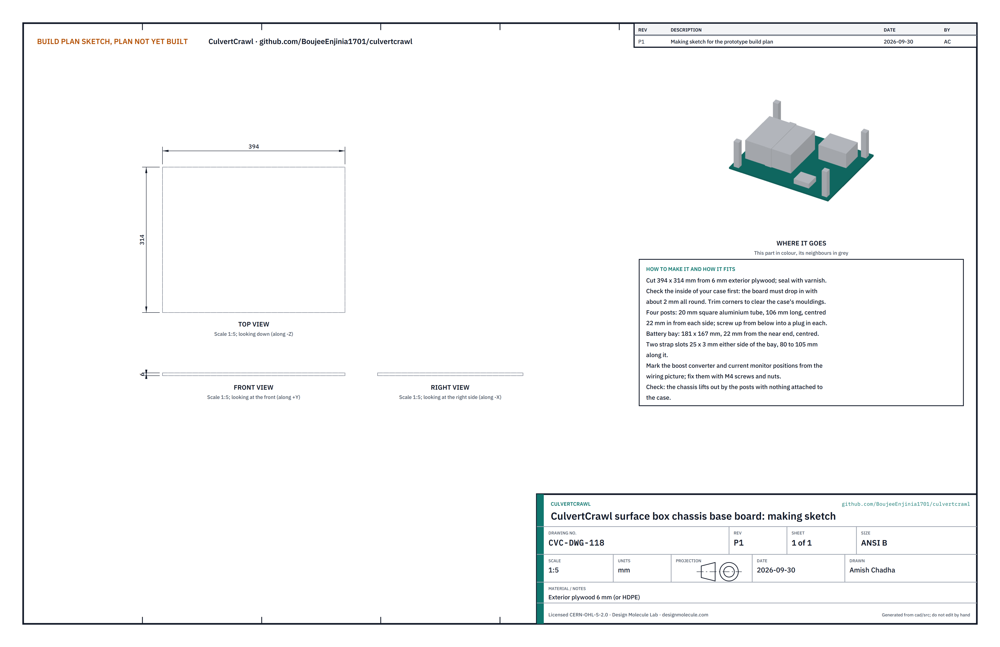

*Figure 36. Chassis base board making sketch (CVC-DWG-118).*

**What it is and what it is made from.** A board that drops into the bottom of the bought case, carrying the battery, the boost converter and the current monitor, with four posts that hold the panel. Exterior plywood 6 mm (or HDPE); aluminium square tube 20 mm.

**How to make it.**

1. Measure the inside of your case first, then cut the board about 2 mm smaller all round (394 x 314 mm in the model); trim its corners to clear the case's mouldings and seal it with varnish.
2. Cut four posts 106 mm long from the square tube; press a plastic plug into each end and screw them up from below, centred 22 mm in from each side.
3. Mark the battery bay, 181 x 167 mm, 22 mm from the board's end nearest the reel; cut two 25 x 3 mm strap slots either side of it.
4. Mark and drill the converter and monitor positions from Figure 15 and fix them with M4 screws and nuts.

**How it fits the parts next to it.** The board lies on the case floor; the battery lies on its side in its bay, held by the strap; the panel screws to the post tops. Nothing is screwed to the case.

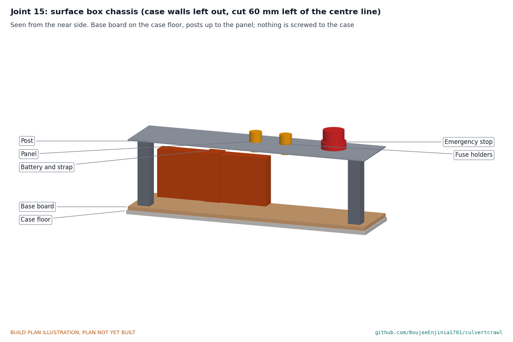

*Figure 37. Base board on the case floor, posts up to the panel, battery strapped down (case walls left out of the picture).*

**Check before moving on.** The chassis lifts out by its posts with nothing left attached to the case.

### 3.21 Surface box panel

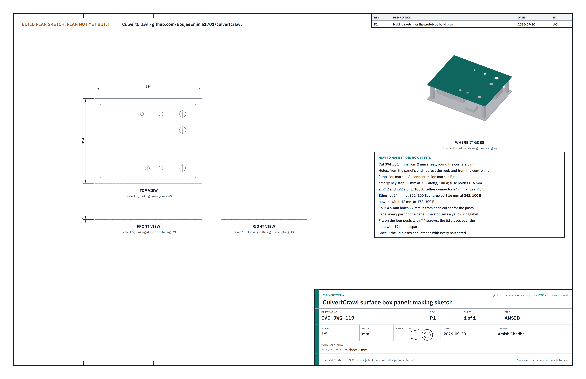

*Figure 38. Chassis panel making sketch (CVC-DWG-119).*

**What it is and what it is made from.** The top plate of the chassis, under the case lid, carrying the controls. 5052 aluminium sheet 2 mm, 394 x 314 mm.

**How to make it.**

1. Cut it and round the corners 5 mm.
2. Measured from the end nearest the reel and from the centre line, on side A: the emergency stop, 22 mm hole at 322 along, 100 out; two fuse holders, 16 mm holes at 242 and 192 along, 100 out. On side B: the tether connector, 24 mm at 322 along, 40 out; the Ethernet bulkhead, 24 mm at 322 along, 100 out; the charge port, 16 mm at 242 along, 100 out; the power switch, 12 mm at 172 along, 100 out.
3. Four 4.5 mm holes 22 mm in from each corner for the posts.
4. Label every part; put a yellow ring label behind the stop.

**How it fits the parts next to it.** Four M4 screws into the posts; the lid closes over the stop with 19 mm to spare.

**Check before moving on.** With every part fitted, the lid closes and latches.

### 3.22 Other bought components

Buy to specification, not brand. Line numbers are those of the bill of materials.

- **Electronics (line 4).** Raspberry Pi 4 Model B 2 GB; dual DC motor driver with current limit; 36 to 75 V input to 12 V buck converter; 12 to 5 V buck converter; 6-axis IMU; leak sensor; microSD card; 4 mm spacers and 20 mm M2.5 standoffs.
- **Camera and dome (line 5).** 12 MP IMX708 camera board with an M12 lens mount; 180 degree class circular fisheye M12 lens whose image circle fits inside the sensor height; 60 mm acrylic dome port with a 72 mm, 5 mm flange and its O-ring.
- **LEDs (line 6).** Eight 1 W high-CRI white LEDs on 10 mm round aluminium boards, and a dimmable constant-current driver that can follow a frame signal.
- **Laser (line 7).** A Class 2 (1 mW or less) 520 nm laser module 12 mm across; a 90 degree conical mirror with a base 20 mm or less; clear acrylic tube 18 x 12 mm and 26 x 22 mm; clear cast acrylic sheet 8 mm.
- **Reel parts (line 10).** A 6-circuit slip ring rated for 100 Mbit/s Ethernet, with an anti-rotation tab; two 20 mm bore 2-bolt flanged bearings; two 20 mm flange shaft hubs; 20 mm aluminium tube (14 mm bore) about 210 mm long; an M8 star-knob screw with a nylon pad; the payout counter (50 mm wheel, 600-count encoder, pinch roller, USB reader).
- **Surface box (line 11).** A rugged waterproof case about 410 x 330 x 175 mm outside; a 12.8 V 20 Ah LiFePO4 battery with its own BMS; a 12 to 48 V 100 W boost converter; 10 A and 2 A fuses in panel holders; a latching emergency stop with a normally closed contact rated 10 A DC; a tether current monitor with a 1.5 A cutoff relay; tether, Ethernet and charge connectors; a power switch; a battery strap.
- **Gamepad (line 12).** Any USB gamepad.
- **Fixings and consumables (line 13).** Stainless: 10 x M4 x 12 pan-head screws (lid); 10 x M4 countersunk screws (side plates); 4 x M4 x 16 screws (bezel); 2 x M4 x 10 and 2 x M3 x 16 with nyloc nuts (fin); 4 x M3 x 6 (tray); M8 eye bolt; M6 and M8 shoulder bolts; seven M6 tie rods with nuts and washers; 4 x M8 bearing bolts; O-rings for the lid, the dome and the six screw seals; silicone grease; potting epoxy; acrylic solvent cement; thermal pad; desiccant; cable ties and heat-shrink.

## 4. Putting it together

In each picture the parts already fitted are grey and the part being fitted is in colour, with an arrow showing the way it goes in.

### Step 1: hull onto the ballast plate

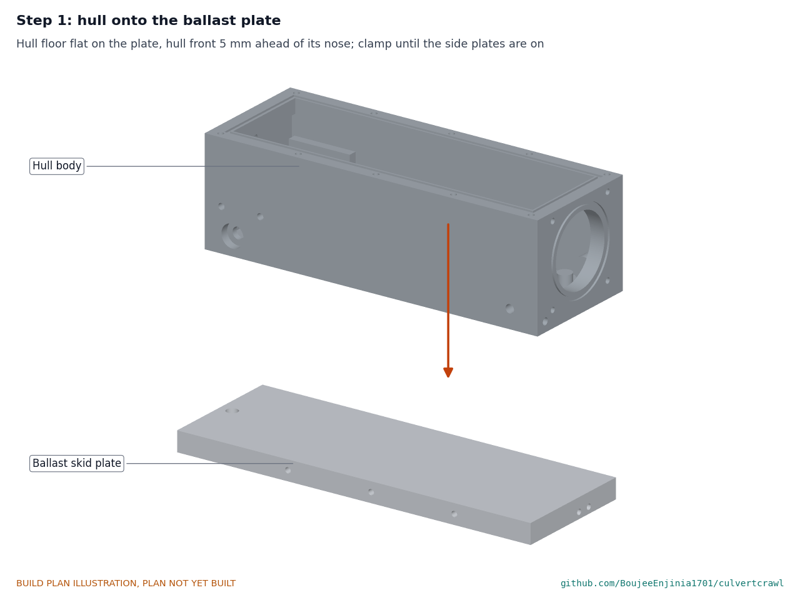

Stand the hull on the plate with its front 5 mm ahead of the plate's nose and its sides flush with the plate's sides. Clamp the two together until the side plates are on.

### Step 2: shaft lip seals into the side walls

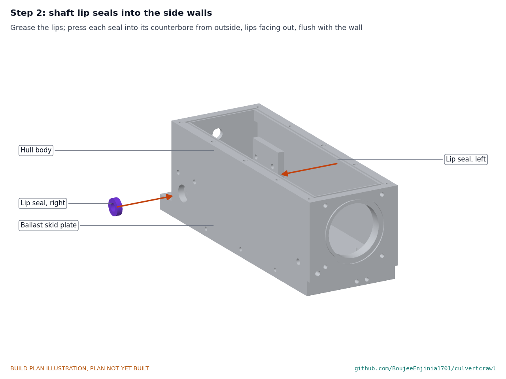

Grease the lips and press each seal into its counterbore from outside, lips facing out, flush with the wall face. Use a socket the size of the seal's outer ring, not the lips.

### Step 3: worm gear motors into the hull

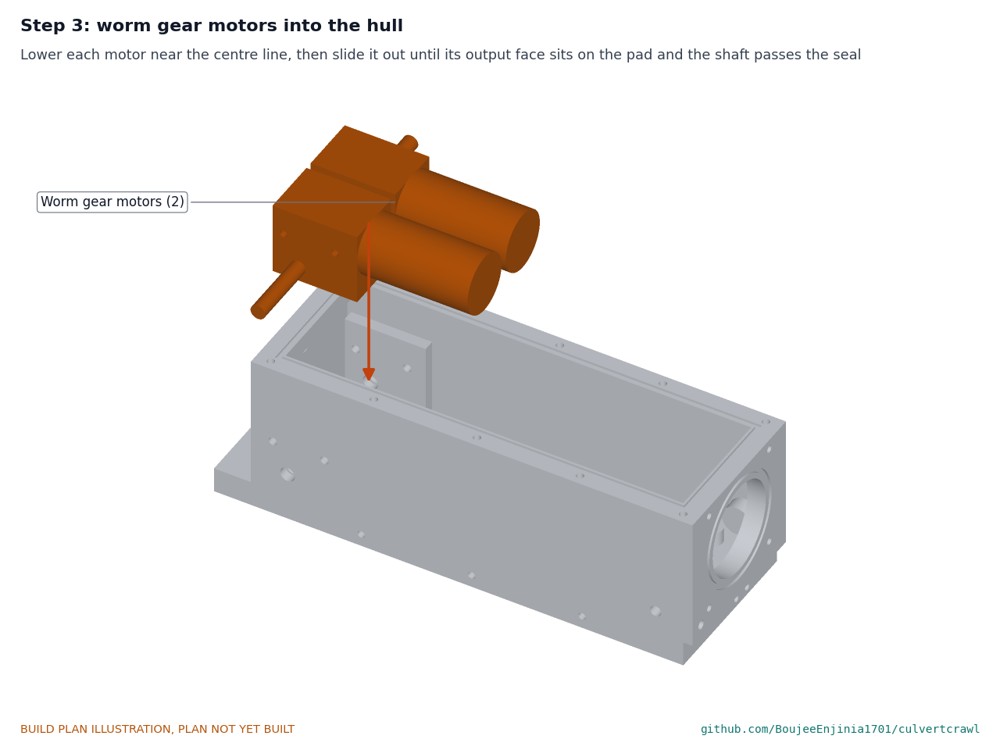

Lower each motor in near the centre line (it passes the rim that way), then slide it out until its output face sits flat on the drive pad and its shaft passes through the seal.

### Step 4: side plates on

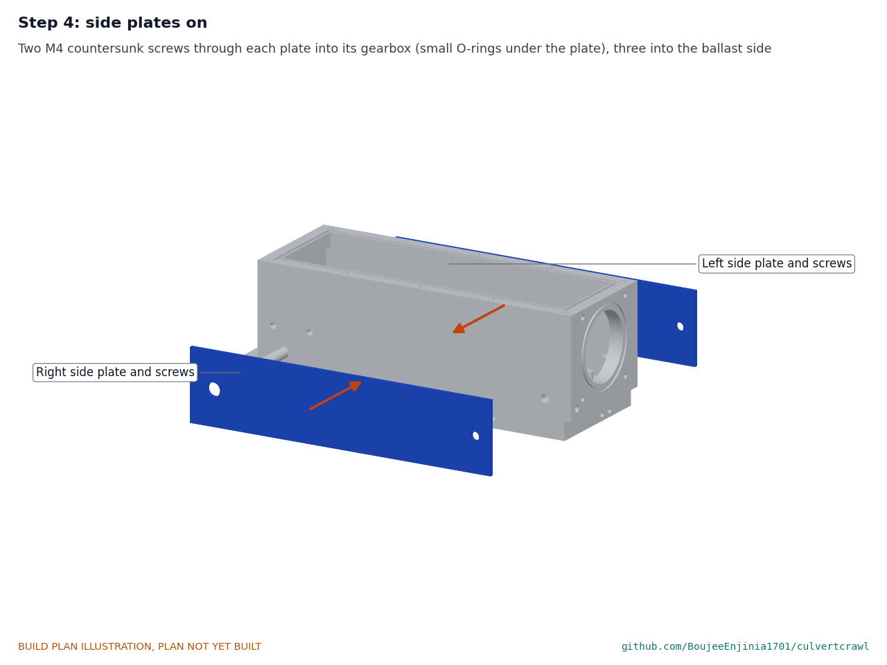

Put a small greased O-ring in the counterbore round each gearbox screw hole. Hold each plate flat on the hull and ballast sides; fit the two M4 countersunk screws through the plate and wall into the gearbox, then the three into the ballast side, with medium threadlocker. Tighten evenly, then take the clamps off. **Hold point:** each motor shaft turns by hand without binding.

### Step 5: sprockets, idlers and belts

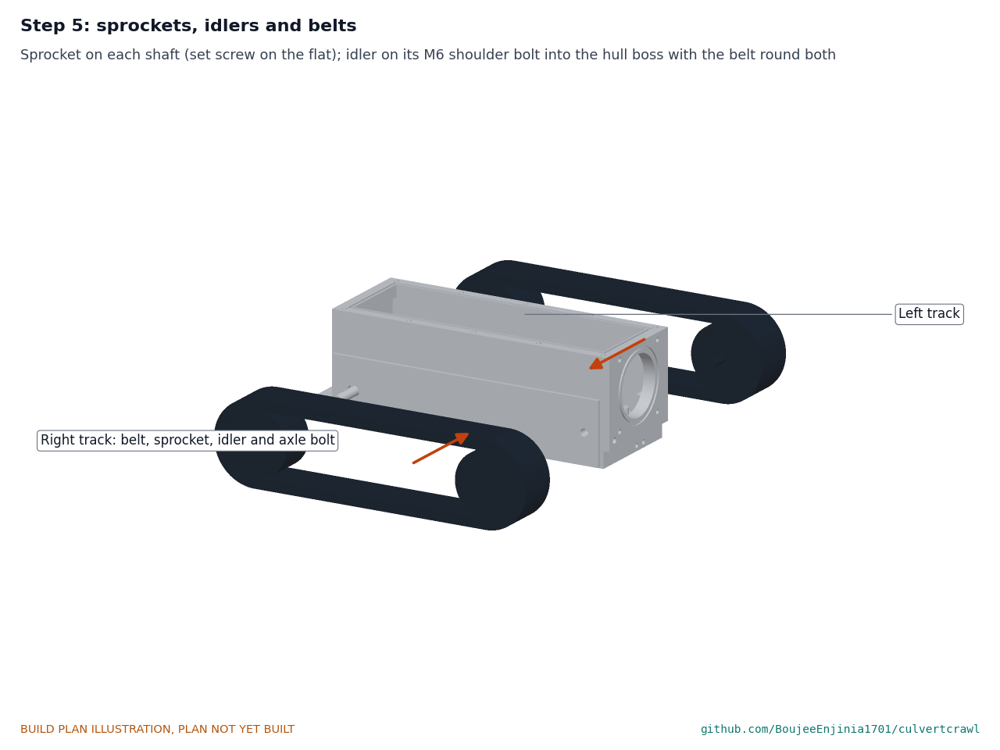

Slide each sprocket onto its shaft and tighten its set screw on the flat. Loop the belt round the sprocket, hold the idler in the belt's other end and push the M6 shoulder bolt through the idler and side plate into the hull boss; tighten it.

### Step 6: electronics tray onto the floor pads

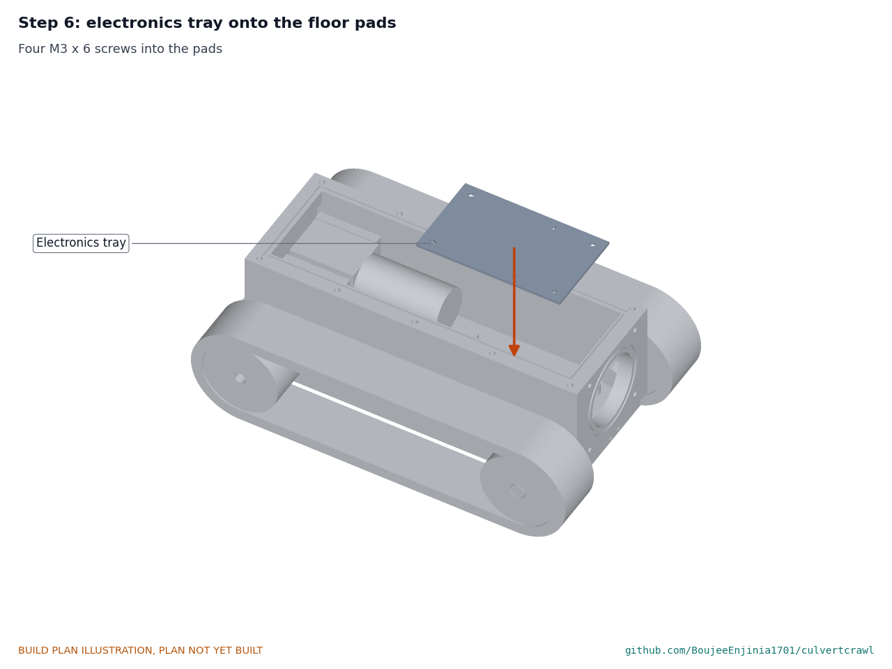

Four M3 x 6 screws into the pads.

### Step 7: Pi 4 and deck

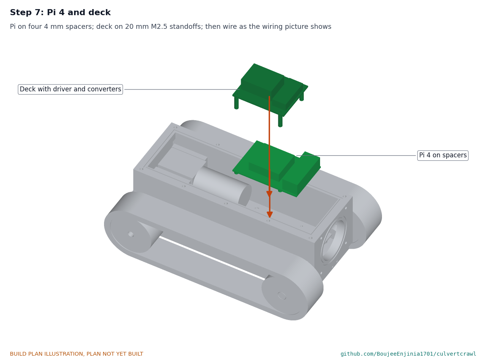

The Pi on four 4 mm spacers, the thermal pad under its heat sink; the deck on four 20 mm standoffs. Wire the motors, encoders, converters, driver and IMU as Figure 15 shows. **Hold point:** the wiring checks of section 3.6.1 pass.

### Step 8: camera mount and camera onto the front wall

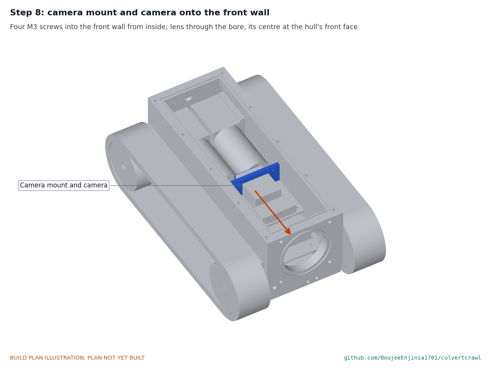

Four M3 screws into the front wall from inside. Connect the camera cable to the Pi.

### Step 9: dome port onto the front wall

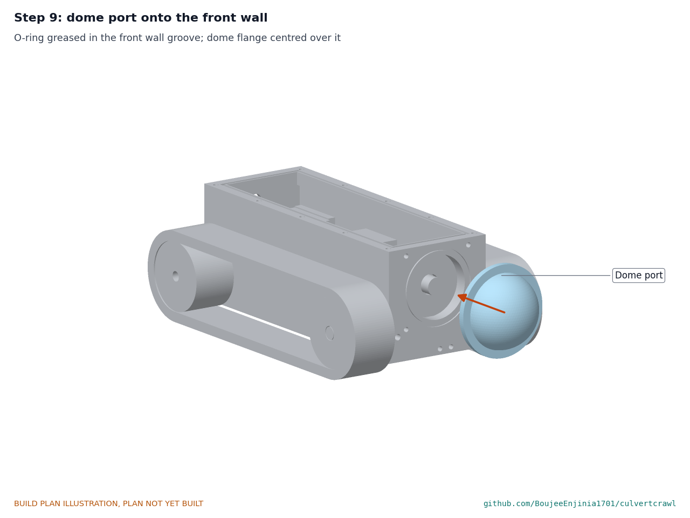

Lay the greased O-ring in the front wall groove and centre the dome flange over it.

### Step 10: front bezel over the dome

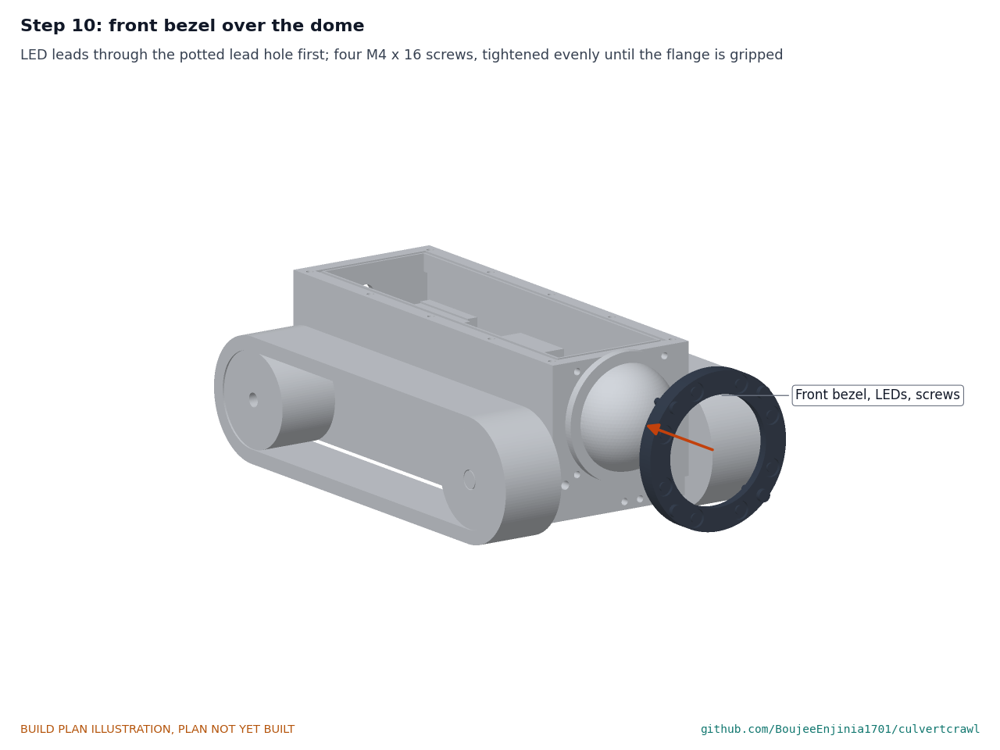

Pass the LED leads into the hull through the lead hole first. Fit the bezel over the dome with four M4 x 16 screws, tightened a little at a time in a cross pattern until the flange is gripped evenly.

### Step 11: fin bracket onto the ballast nose

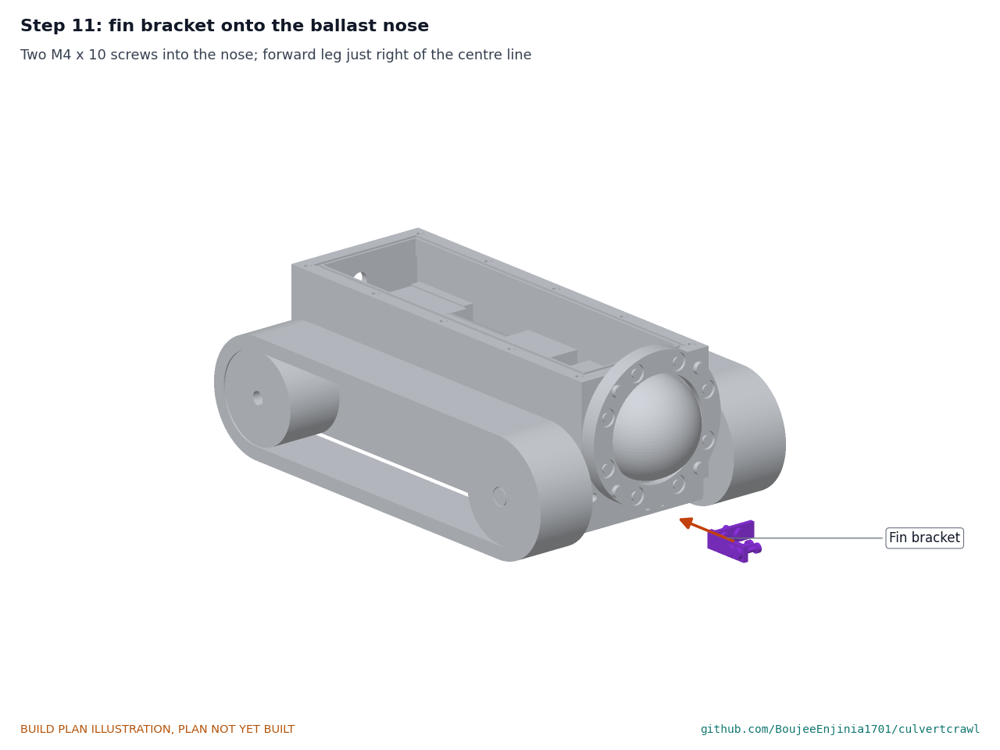

Two M4 x 10 screws into the nose, the forward leg just right of the centre line.

### Step 12: fin, boom and laser head

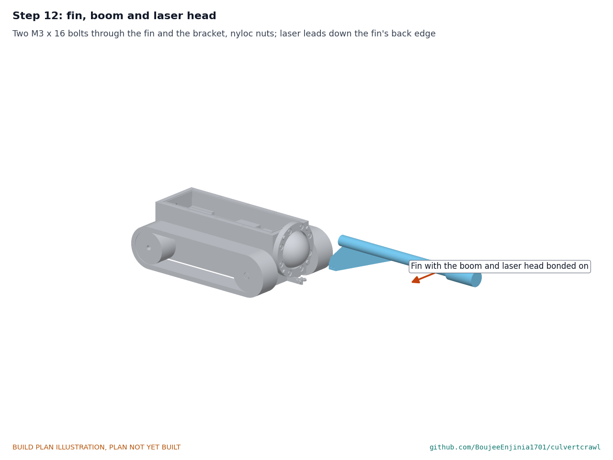

With the boom and head already bonded to the fin, bolt the fin to the bracket's forward leg with two M3 x 16 bolts and nyloc nuts. Run the laser leads down the fin's back edge and into the lead hole with the LED leads; pot the lead hole from outside with epoxy.

### Step 13: tether penetrator, strain relief and eye bolt

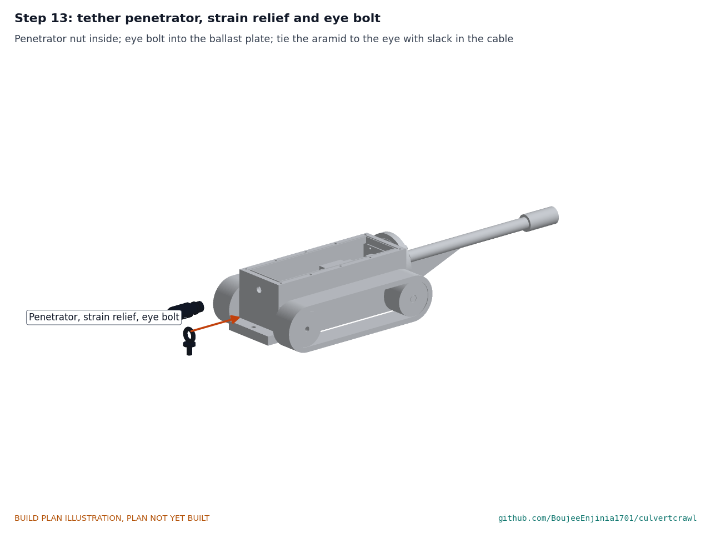

Screw the eye bolt into the ballast plate and lock it with its nut. Fit the potted penetrator in the rear wall, nut inside, and slide the strain relief onto it. Tie the aramid member to the eye with slack in the cable. Connect the tether's power wires to the buck converter and its pairs to the Ethernet plug.

### Step 14: lid on


Put a fresh desiccant pack in. Clean and grease the O-ring and lay it in the rim groove. Fit the lid with ten M4 screws in a cross pattern, and the test plug. **Hold point:** the leak test of section 3.1 passes before the crawler goes near water.

### Step 15: reel frame


Three spacer tubes between the two frames on M6 tie rods, the counter bar between the two halves of the front spacer. Snug the nuts.

### Step 16: bearings onto the frames


One flanged bearing on the outside of each frame with two M8 bolts; leave its set screws loose.

### Step 17: drum, flanges and hubs


Stand the drum between the flanges, push the four tie rods through and tighten their nuts evenly. Bolt a shaft hub to each flange's outer face.

### Step 18: drum into the frame, axle through


Hold the drum between the frames and slide the axle in through one bearing, both hubs and the other bearing. Centre the drum, tighten the hub set screws, then the bearing set screws. Pass the tether's inner end through the drum hole and along the hollow axle to the slip ring end.

### Step 19: crank, brake, slip ring and anchor


The crank on the left axle end; the brake knob into the left frame; the slip ring's rotor fixed to the right axle end, its rotor leads joined to the tether's inner end; the anchor bolted to the right frame so it catches the slip ring body.

### Step 20: payout counter onto its bar


Two M5 bolts. Thread the tether between the wheel and the pinch roller, then wind the tether onto the drum evenly.

### Step 21: battery, converter and posts onto the base board


The battery on its side in its bay, strapped down; the boost converter and current monitor on M4 screws; the four posts screwed up from below. **Hold point:** the battery fuse stays out.

### Step 22: panel onto the posts


Fit and wire the stop, fuse holders, connectors and switch to the panel first, then fix the panel to the posts with four M4 screws.

### Step 23: chassis into the case


Lower the chassis into the case; nothing is screwed to the case. Close the lid and check it latches.

## 5. First checks

These are the checks a TRL 4 test report would record; this plan only lists them. Requirement numbers are those of CVC-REQ-001.

*Table 2. First checks.*

| Check | Requirement | How | Pass when |
| --- | --- | --- | --- |
| Hull leak test | R7 | 20 kPa of air through the test plug, everything fitted | Less than 1 kPa drop in 10 minutes |
| Size and fit | R1 | Measure; roll the crawler through a 300 mm pipe section | 180 mm wide and 140 mm high or less; nothing touches the wall |
| Mass | R10 | Weigh the crawler, the reel with tether and the surface box | Crawler about 6.6 kg; no item over 10 kg; kit 25 kg or less |
| Tether voltage and stop | R11 | Surface box on, crawler connected, meter at the crawler's buck input; then press the stop | About 46 V or more at the crawler; 0 V within a second of the stop |
| Overcurrent cutoff | R11 | Bench load on the tether output, raised slowly | Output cuts at 1.5 A |
| Drive and hold | R8 | Drive forward and back on a bench; then stand the crawler on a 5 % ramp, power off | Both tracks turn both ways; no creep on the ramp |
| Video | R4 | Stream to the laptop | 1080p at 25 frames per second, with the overlay |
| Laser ring | R5, R11 | Crawler in a 300 mm reference pipe in the dark; laser module's class label checked | A complete, sharp ring except the thin strip behind the fin; module Class 2 |
| Payout counter | R6 | Pull 10 m of tether out past a tape | The count reads 10 m within 0.1 m |
| Recovery | R3 | Tracks locked, pull the crawler by the tether on a bench | It slides; the pull goes to the eye bolt, not the penetrator |

## 6. Safety stops

Stop at each point. Carry on only when everything listed is true.

- **S1. Before the battery comes into the workshop.** Battery voltage 12.0 to 13.6 V; no swelling, dents or leaks; a datasheet from its maker; its BMS present. A charging spot ready on a non-combustible surface with an extinguisher for electrical fires within reach.
- **S2. Before the battery fuse goes in.** All wiring checked end to end with the fuse out; polarity at the boost input checked with a meter, not by wire colour; the stop wired so that pressing it opens the boost input.
- **S3. Before 48 V goes onto the tether.** The 2 A tether fuse fitted; the boost output measured at 48 V on the bench with no load; the overcurrent cutoff tested with a bench load; the stop tested.
- **S4. Before the crawler is powered.** The buck converter's input polarity checked at the penetrator; the motors' tracks off the bench (crawler on a stand) so they can turn freely.
- **S5. Before the laser is switched on.** The laser module's label shows Class 2 (1 mW or less); everyone in the room told; the beam pointed into a pipe or at a wall, never at eye height.
- **S6. Before the crawler goes in water.** The hull leak test of section 3.1 passed within the last day; the test plug and every lid screw tight; the leak sensor tested.
- **S7. Before any pipe work outside the workshop (outside this plan).** A second person; air at the mouth checked with a four-gas monitor; traffic control as the road owner requires; nobody enters the pipe, including to free the crawler; the tether never tied to a vehicle.

## 7. Tools, skills and workspace

**Tools.** A CNC mill or a machine shop for the hull, lid and bezel (send CVC-DWG-101, 102 and 107 and the hull hole picture); a lathe, or the same shop, for the laser housing and end cap; a bench drill; drills 2 to 21 mm; a countersink; M3, M4, M6, M8 and M10 x 1 taps; a hacksaw and a jigsaw with a metal blade; files and a deburring tool; a scriber, square, rule and calipers; a 3D printer for PETG or ASA; a laser cutter or a fine saw for the acrylic fin; a disc sander; a soldering iron, ferrule crimper and wire strippers; a multimeter; a bench power supply with a current limit (0 to 60 V, 0 to 3 A); a bench load; a hand pump with a gauge reading to 30 kPa; a torque screwdriver; a scale to 10 kg.

**Skills.** No certified trade is needed. Basic metalwork (marking out, sawing, drilling, tapping, filing), reading a machining drawing well enough to order parts from a shop, solvent-welding acrylic, potting, through-hole soldering and crimping, safe use of a bench supply, and care with lithium batteries. All circuits are extra-low voltage: 12.8 V at the battery and 48 V on the tether, below the 60 V DC limit. No mains wiring is part of this build; the battery charger must be a certified LiFePO4 charger.

**Workspace.** A bench about 1.5 x 0.75 m; a metalwork corner kept apart from the electronics; a ventilated place for the printer, solvent and epoxy; the charging spot of S1; a dark corner and a short length of 300 mm pipe for the laser check.

**Personal protective equipment.** Safety glasses for cutting, drilling, soldering and solvent work; cut-resistant gloves for bar, sheet and the acrylic; nitrile gloves for epoxy and solvent; hearing protection when sawing; no gloves near a turning drill; laser safety glasses rated for 520 nm if the beam is aligned by eye.

## 8. Where the numbers come from

- Model and constructability checks: `cad/src/model.py` (`python cad/src/model.py --check`, 94 checks); STEP and STL exports in `cad/step/` and `cad/stl/`.
- Pictures: `cad/src/build_plan_media.py`, using `.kit/build_views.py`; written to `docs/05-build-plan/` and `cad/drawings/CVC-DWG-101` to `CVC-DWG-119`.
- General arrangement: `cad/drawings/CVC-DWG-001.pdf`, Rev P3.
- Calculations: `docs/04-calcs/01-sizing.md` (CVC-CAL-001 v0.4) and `docs/04-calcs/sizing.py`; masses from model volumes, reach, recovery pull, fin shadow and profiling error.
- Bill of materials: `bom/bom.csv` (15 lines).
- Decisions: `docs/decisions/0003-design-for-construction.md` (CVC-DDR-003), with CVC-DDR-001 and CVC-DDR-002; open items in `docs/06-design-decisions.md` (CVC-DEC-001).
- Requirements: `docs/03-requirements.md` (CVC-REQ-001 v0.6).
